# Complete ResPro Flow Map

This document is the highest-signal architecture reference for ResistanceProfiler. It is designed for two audiences:

- contributors who need one place to see how the main runtime paths connect end to end
- Copilot or other coding assistants that need a fast, function-level orientation before making changes

The graph below is intentionally function-centric. Module prefixes are kept in the node labels so the implementation surface is easy to find in the codebase.

## How to read this map

- Read from top to bottom for the main execution flow.
- The left side shows project creation and maintained-database bootstrap.
- The center shows the canonical profiling pipeline shared by CLI and web-triggered runs.
- The right side shows persistence, report generation, regeneration, and maintenance flows.
- Dashed edges indicate optional or reuse-based paths rather than the primary happy path.

## Complete Runtime Graph

```mermaid
flowchart TB
    classDef entry fill:#0f172a,color:#ffffff,stroke:#0f172a,stroke-width:1px;
    classDef cli fill:#dbeafe,color:#0f172a,stroke:#60a5fa,stroke-width:1px;
    classDef core fill:#dcfce7,color:#14532d,stroke:#4ade80,stroke-width:1px;
    classDef io fill:#fef3c7,color:#78350f,stroke:#f59e0b,stroke-width:1px;
    classDef db fill:#ede9fe,color:#4c1d95,stroke:#8b5cf6,stroke-width:1px;
    classDef report fill:#fee2e2,color:#7f1d1d,stroke:#f87171,stroke-width:1px;
    classDef web fill:#e0f2fe,color:#0c4a6e,stroke:#38bdf8,stroke-width:1px;
    classDef store fill:#f3f4f6,color:#111827,stroke:#9ca3af,stroke-width:1px;

    subgraph S1["1. Entry Surfaces"]
        USERCLI["User or automation<br/>CLI invocation"]:::entry
        USERWEB["Browser user<br/>Web UI session"]:::entry
        CLIMAIN["respro.cli.main<br/>Typer app + command registration"]:::entry
        WEBAPP["web.backend.main.create_app<br/>FastAPI app assembly"]:::entry
    end

    subgraph S2["2. Project Build and Database Provisioning"]
        INITCMD["respro.cli.init._init_command"]:::cli
        ADDCMD["respro.cli.init._init_add_command"]:::cli
        INITPROJ["respro.cli.init.init_project"]:::cli
        ADDPROJ["respro.cli.init.add_to_project"]:::cli
        GENBANKPARSE["respro.io.genbank.parse_genbank_sources"]:::io
        SCHEMA["respro.db.schema.create_schema<br/>respro.db.schema.open_project_db"]:::db
        LOADGENES["respro.db.genes._load_genbank_records"]:::db
        IMPORTRULES["respro.core.rules.import_rules_with_summary<br/>respro.core.rules.validate_rules_tsv"]:::core
        METADATA["respro.db.project_metadata.load_metadata_json<br/>store_project_metadata"]:::db
        DRUGINFO["respro.db.drugs._get_drugs_from_pubchem"]:::db
        PROJECTDB[("project.db")]:::store
    end

    subgraph S3["3. Shared Query Resolution and Internal Reference Selection"]
        RESOLVEQUERY["respro.core.query.resolve_fasta_query"]:::core
        READFASTA["respro.io.reference.read_fasta"]:::io
        CACHEDQUERY["respro.core.query._load_cached_query_matches<br/>respro.core.alignment.load_cached_mappings"]:::core
        LOADRULEGENES["respro.core.alignment.load_genes_with_rules"]:::core
        MATCHQUERY["respro.core.alignment.match_query_to_genes<br/>_match_with_mappy | _match_with_pairwise"]:::core
        STOREMAPPINGS["respro.core.alignment.store_mappings"]:::db
        PICKREF["respro.core.query.pick_best_reference_id<br/>select_matches_for_reference"]:::core
        LOADREFDATA["respro.cli.profile_helpers._load_reference_data<br/>load_genes_for_reference + load_rules + load_formula_rules"]:::cli
    end

    subgraph S4["4. VCF Profiling Path"]
        VCFCMD["respro.cli.vcf._profile_vcf_command"]:::cli
        INITRESULTS["respro.cli.profile_helpers._init_results_db_connection"]:::cli
        PARSEVCF["respro.io.vcf.parse_vcf"]:::io
        REMAPVCF["respro.core.vcf_remap.remap_variants"]:::core
        BAMCOV["respro.core.vcf_coverage.compute_coverage_gaps_from_bam"]:::core
        ANNOTVCF["respro.core.annotation.annotate_variants"]:::core
    end

    subgraph S5["5. FASTA Profiling Path"]
        FASTACMD["respro.cli.fasta._profile_fasta_command"]:::cli
        F2VCF["respro.core.fasta_to_vcf.fasta_to_vcf"]:::core
        ANNOTFASTA["respro.core.annotation.annotate_variants<br/>(is_fasta_mode=True)"]:::core
    end

    subgraph S6["6. Shared Matching, Result Assembly, Export, and Persistence"]
        FINALIZE["respro.cli.profile_helpers._finalize_and_export"]:::cli
        OVERLAPFILTER["respro.cli.profile_helpers._suppress_ruleless_overlap_annotations"]:::cli
        MATCHRULES["respro.core.rules.match_rules"]:::core
        MATCHFORMULA["respro.core.rules.match_formula_rules"]:::core
        AFBINS["respro.cli.profile_helpers.assign_af_bins"]:::cli
        PROFILEOBJ["respro.db.models.ProfilingResult"]:::db
        EXPORT["respro.report.non_html_exports.export_results"]:::report
        CONTEXT["respro.report.html.build_report_context"]:::report
        PLOTS["respro.report.plots.render_lollipop_plot_bytes"]:::report
        HTML["respro.report.html.render_html<br/>respro.report.html.write_html"]:::report
        JSON["respro.report.non_html_exports.write_json"]:::report
        TSV["respro.report.non_html_exports.write_tabular"]:::report
        PDF["respro.report.non_html_exports.write_pdf"]:::report
        SAVERUN["respro.db.results.save_run"]:::db
        RESULTSDB[("results.db")]:::store
        ARTIFACTS[("HTML / JSON / TSV / PDF artifacts")]:::store
    end

    subgraph S7["7. Regeneration, Classification, Sync, and Inspection"]
        REGENCMD["respro.cli.regenerate.regenerate"]:::cli
        LOADRUN["respro.db.results.load_run<br/>load_run_from_json"]:::db
        LOADAUX["load_coverage_gaps<br/>load_formula_rule_hits<br/>load_classifications"]:::db
        VALIDATEFP["respro.db.results.validate_project_fingerprint_match"]:::db
        RECONSTRUCT["respro.db.results.reconstruct_annotations<br/>reconstruct_formula_rule_hits"]:::db
        REGENREF["respro.io.reference.load_genes_for_reference<br/>respro.core.rules.load_rules"]:::core
        CLASSIFY["respro.cli.classify.classify<br/>respro.db.results.save_classification"]:::cli
        SYNC["respro.cli.sync.sync_results_database<br/>_sync_single_run"]:::cli
        RESOLVECACHED["respro.core.query.resolve_cached_query_reference"]:::core
        EXPLORE["respro.cli.explore.manage_database<br/>manage_results"]:::cli
        RULESVIEW["respro.db.rules_queries.list_rules_for_display<br/>list_formula_rules_for_display<br/>get_project_summary_for_display"]:::db
        RUNSVIEW["respro.db.results.list_runs<br/>delete_run"]:::db
    end

    subgraph S8["8. Web Runtime and Queue Wrapper"]
        STARTUP["web.backend.startup_config.load_startup_config"]:::web
        BROWSEAPI["web.backend.services.browse.list_databases<br/>list_rules"]:::web
        UPLOADAPI["web.backend.services.upload.save_upload_stream<br/>cleanup_session_files"]:::web
        APIRoutes["web.backend.main routes<br/>/api/profile/* | /api/regenerate/json<br/>/api/jobs/{id} | /api/report | /api/artifact*"]:::web
        QUEUE["web.backend.queue.get_queue<br/>get_batch_queue"]:::web
        JOBS["web.backend.jobs.run_profile_vcf<br/>run_profile_fasta<br/>run_regenerate_json"]:::web
        SUBPROC["web.backend.jobs._run_respro_command<br/>python -m respro.cli.main ..."]:::web
        REDIS[("Redis / RQ broker")]:::store
    end

    subgraph S9["9. Maintained Database Catalog Flow"]
        DBCMD["respro.cli.maintained_db._maintained_db_command"]:::cli
        DBLIST["respro.cli.maintained_db._list_command"]:::cli
        DBDL["respro.cli.maintained_db._download_command"]:::cli
        MDBIO["respro.io.maintained_db.list_maintained_databases<br/>fetch_database_metadata<br/>download_database_files"]:::io
    end

    USERCLI --> CLIMAIN
    USERWEB --> WEBAPP

    CLIMAIN --> INITCMD
    CLIMAIN --> ADDCMD
    CLIMAIN --> VCFCMD
    CLIMAIN --> FASTACMD
    CLIMAIN --> REGENCMD
    CLIMAIN --> CLASSIFY
    CLIMAIN --> SYNC
    CLIMAIN --> EXPLORE
    CLIMAIN --> DBCMD

    INITCMD --> INITPROJ
    ADDCMD --> ADDPROJ
    INITPROJ --> GENBANKPARSE --> LOADGENES
    INITPROJ --> METADATA
    INITPROJ --> SCHEMA
    ADDPROJ --> SCHEMA
    SCHEMA --> PROJECTDB
    LOADGENES --> PROJECTDB
    INITPROJ --> IMPORTRULES --> PROJECTDB
    ADDPROJ --> IMPORTRULES
    METADATA --> PROJECTDB
    INITPROJ -. optional enrichment .-> DRUGINFO --> PROJECTDB
    ADDPROJ -. optional enrichment .-> DRUGINFO

    VCFCMD --> SCHEMA
    FASTACMD --> SCHEMA
    VCFCMD --> INITRESULTS --> RESULTSDB
    FASTACMD --> INITRESULTS
    VCFCMD --> RESOLVEQUERY
    FASTACMD --> RESOLVEQUERY

    RESOLVEQUERY --> READFASTA
    RESOLVEQUERY -. cache hit .-> CACHEDQUERY
    RESOLVEQUERY -. cache miss .-> LOADRULEGENES --> MATCHQUERY --> STOREMAPPINGS
    RESOLVEQUERY --> PICKREF --> LOADREFDATA
    LOADREFDATA --> PROJECTDB

    VCFCMD --> PARSEVCF --> REMAPVCF --> ANNOTVCF
    RESOLVEQUERY --> REMAPVCF
    VCFCMD -. optional BAM .-> BAMCOV
    RESOLVEQUERY -. query/match context .-> BAMCOV
    ANNOTVCF --> FINALIZE
    BAMCOV -. coverage gaps .-> FINALIZE
    LOADREFDATA --> FINALIZE

    FASTACMD --> F2VCF --> ANNOTFASTA --> FINALIZE
    RESOLVEQUERY --> F2VCF
    LOADREFDATA --> FINALIZE

    FINALIZE --> OVERLAPFILTER --> MATCHRULES --> MATCHFORMULA --> AFBINS --> PROFILEOBJ
    PROFILEOBJ --> EXPORT
    EXPORT --> PLOTS --> HTML
    EXPORT --> CONTEXT --> HTML
    EXPORT --> JSON
    EXPORT --> TSV
    EXPORT --> PDF
    HTML --> ARTIFACTS
    JSON --> ARTIFACTS
    TSV --> ARTIFACTS
    PDF --> ARTIFACTS
    PROFILEOBJ -. optional persistence .-> SAVERUN --> RESULTSDB

    REGENCMD --> LOADRUN
    LOADRUN --> RESULTSDB
    LOADRUN -. JSON mode .-> ARTIFACTS
    REGENCMD --> LOADAUX --> RESULTSDB
    REGENCMD --> VALIDATEFP --> PROJECTDB
    LOADAUX --> RECONSTRUCT --> PROFILEOBJ
    REGENCMD --> REGENREF --> PROJECTDB
    PROFILEOBJ --> EXPORT

    CLASSIFY --> RESULTSDB
    SYNC --> LOADRUN
    SYNC --> LOADAUX
    SYNC -. FASTA cache recovery .-> RESOLVECACHED --> PROJECTDB
    SYNC --> LOADREFDATA
    SYNC --> FINALIZE
    EXPLORE --> RULESVIEW --> PROJECTDB
    EXPLORE --> RUNSVIEW --> RESULTSDB

    WEBAPP --> STARTUP --> PROJECTDB
    STARTUP --> RESULTSDB
    WEBAPP --> BROWSEAPI --> PROJECTDB
    WEBAPP --> UPLOADAPI
    WEBAPP --> APIRoutes
    APIRoutes --> QUEUE --> REDIS
    QUEUE --> JOBS --> SUBPROC
    SUBPROC --> CLIMAIN
    APIRoutes --> ARTIFACTS
    APIRoutes --> RESULTSDB

    DBCMD --> DBLIST --> MDBIO
    DBCMD --> DBDL --> MDBIO
    DBDL --> INITPROJ
```

## Main flow, in plain language

1. `respro init` or `respro add` creates or extends `project.db` from GenBank annotations, rule TSV files, optional formula rules, optional metadata, and optional external enrichment.
2. `respro vcf` and `respro fasta` both resolve the user sequence against the internal reference space first. This normalization step is what lets ResistanceProfiler keep all interpretation in one curated coordinate system.
3. The VCF path parses external variants and remaps them into internal CDS coordinates. The FASTA path converts alignment differences into VCF-like variant calls. Both then feed the same `annotate_variants()` function.
4. `_finalize_and_export()` is the core CLI convergence point. It filters overlap artifacts, applies atomic and formula rule matching, bins allele frequencies, assembles `ProfilingResult`, exports artifacts, and optionally persists a run to `results.db`.
5. The web app does not reimplement profiling logic. It validates inputs, enqueues RQ jobs, and then calls the CLI in subprocess mode through `python -m respro.cli.main ...`, which reuses the same CLI and reporting stack.
6. `respro regenerate`, `respro classify`, `respro manage`, and `respro manage results --sync` all reuse the same persisted model in `results.db`, with regeneration feeding back into the same export stack.

## Architectural takeaways

- `project.db` is the stable curated knowledge base.
- `results.db` is the run-history and regeneration layer.
- `respro/core/` owns biological interpretation and coordinate normalization.
- `respro/report/` owns rendering and export assembly.
- `web/backend/` is a transport and orchestration layer around the CLI-first engine, not a parallel implementation.
