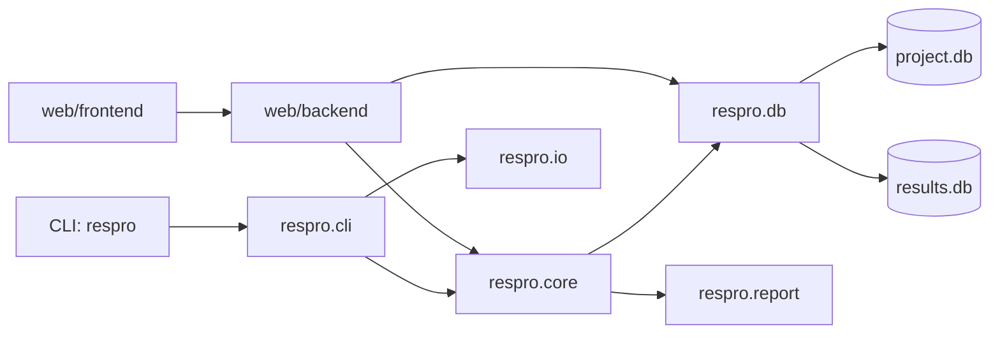
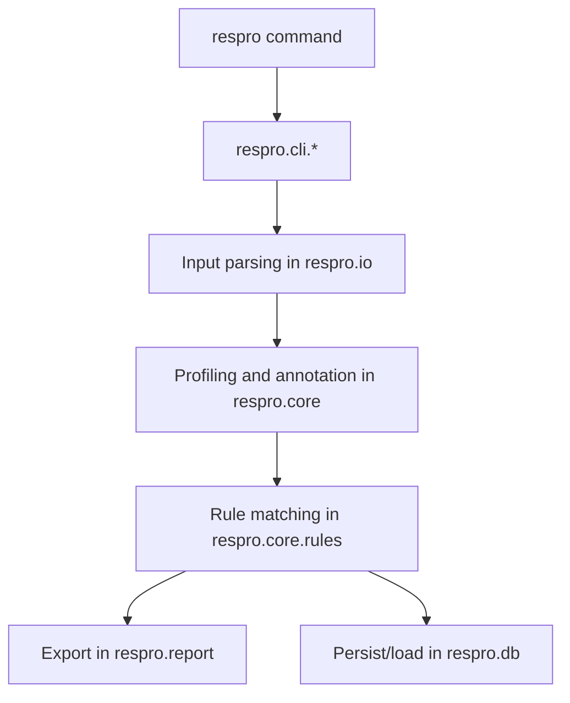
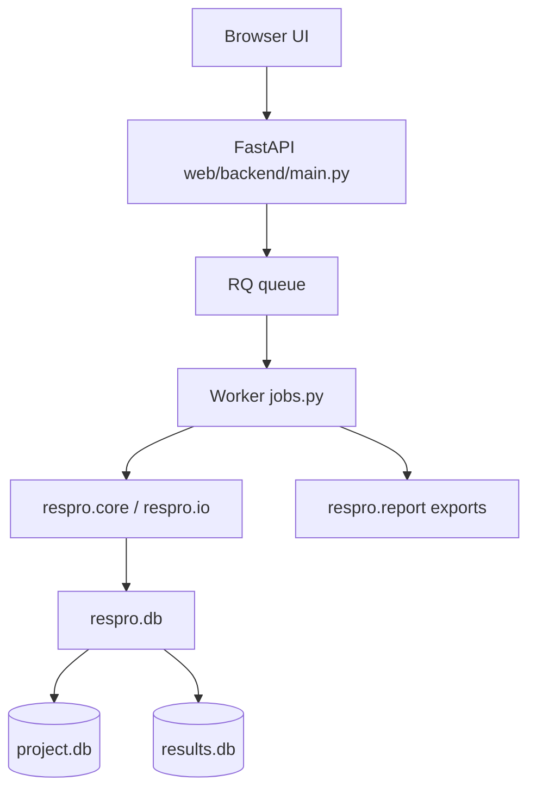

# Development, Contribution, and Architecture

This document combines contributor workflow, project structure guidance, and runtime architecture.

For deeper interaction maps and function-chain views, see:

- `docs/development/detailed_respro_layout.md`
- `docs/development/detailed_app_layout.md`

## Principles

- CLI-first behavior: the `respro` command remains the primary interface.
- Core independence: domain logic lives in `respro/`, not in web-only layers.
- Deterministic outputs: reporting/regeneration flows should remain reproducible.
- Framework-first design: the project database is the stable internal reference layer for profiling.

## Current project structure

High-level module boundaries:

- `respro/cli`: CLI command registration and orchestration
- `respro/core`: reference-normalized profiling and amino-acid interpretation logic
- `respro/io`: format-specific parsing and external data retrieval
- `respro/db`: schema, migrations, and persistence/query helpers
- `respro/report`: HTML/JSON/TSV export and plotting
- `web/backend`: FastAPI API, queue integration, and startup config
- `web/frontend`: React frontend



## CLI development

### Structure indication

- command registration in `respro/cli/main.py`
- one command module per command family:
  - `init.py` (`init`, `add`)
  - `vcf.py`
  - `fasta.py`
  - `regenerate.py`
  - `classify.py`
    - `sync.py` (`sync`)
  - `explore.py` (`manage database`, `manage results`)

### CLI flow



### CLI change guidelines

1. Keep handlers thin and orchestration-focused.
2. Put biological interpretation into `respro/core`.
3. Add focused tests in `tests/` for behavior changes.

## Web app development

### Web structure indication

- backend API entry in `web/backend/main.py`
- job logic in `web/backend/jobs.py`
- service layer under `web/backend/services/`
- startup/runtime config in `web/backend/startup_config.py` and `web/backend/config.py`
  with startup-managed `project_databases/`, `uploads/`, and `results/` directories
- frontend app in `web/frontend/src/`

### Web flow



### Web change guidelines

1. Keep API transport and validation in web layer.
2. Reuse `respro/` logic instead of reimplementing domain behavior.
3. Preserve startup-managed path constraints and auth assumptions, including
  database-catalog selection via `database_id` for browse/profile/regenerate routes.

## Annotation and profiling algorithm (detailed)

This section mirrors the implementation-level logic used by CLI and web paths.

### Shared model

- Internal reference coordinates are the canonical reporting frame.
- Gene strand affects coding interpretation but not global coordinate frame.
- Rule matching is allele/state-driven at amino-acid level.

This is the main architectural advantage of ResPro: curated rules live in one internal reference space, while incoming sample data can start in a different reference space and be normalized back before profiling.

### VCF path

1. Parse VCF into `VariantCall` records.
2. Apply AF/depth filtering.
3. Resolve the query reference FASTA against project references/genes.
4. Remap query-space variants to internal coordinates via CIGAR mappings.
5. Convert remapped nucleotide events into amino-acid consequences (SNP/indel/frameshift classes).
6. Match single and combination rules.
7. Export HTML and optional JSON/TSV, optionally persist run rows.

### FASTA path

1. Resolve FASTA query against project references/genes.
2. Build an alignment-based per-gene walk against the internal reference genes.
3. Emit annotated variants and coverage-gap stretches.
4. Match single and combination rules.
5. Export and optionally persist results.

### Regeneration path

1. Load run data from `results.db` or JSON export.
2. Validate project fingerprint/UUID compatibility.
3. Reconstruct annotation payloads.
4. Re-export HTML and optional JSON/TSV artifacts.

## Contribution workflow

1. Create a focused change with minimal unrelated refactoring.
2. Add or update tests for behavior changes.
3. Run quality gates before opening a PR.
4. Update user/development docs in the same change.

## Local quality gates

```bash
python -m pytest
```

```bash
python -m pytest tests/test_web_api.py -q
```

## Release and compatibility notes

- Keep schema-version changes migration-aware.
- Preserve deterministic report/export outputs.
- Avoid compatibility shims unless explicitly required.
