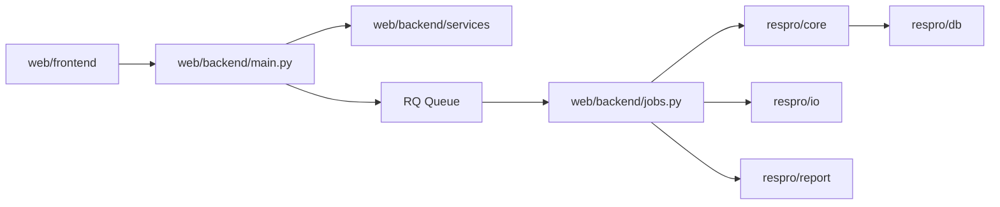
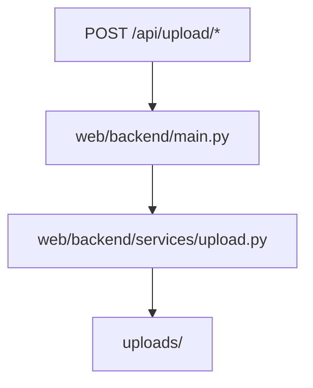
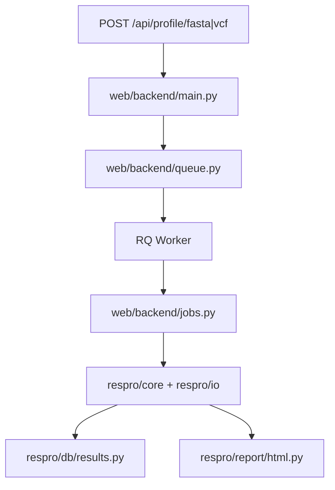
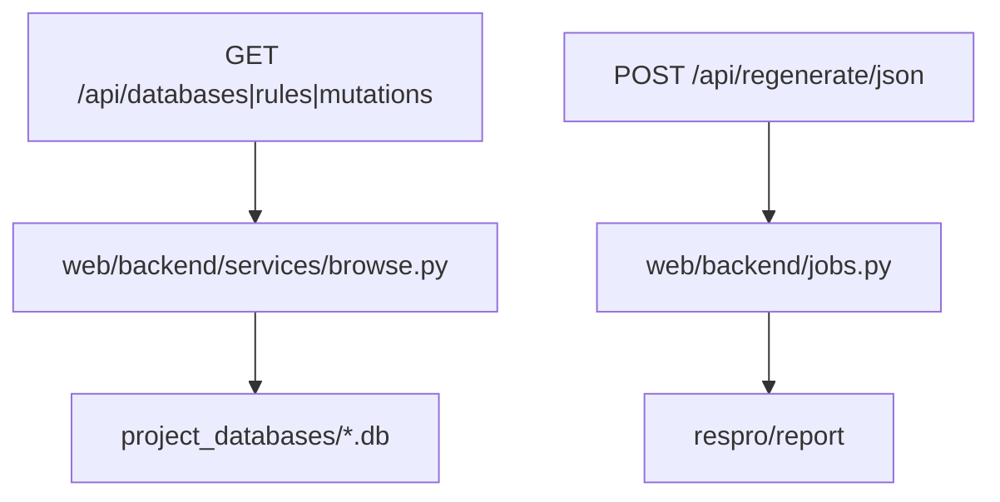

# Detailed App Layout

This document captures detailed runtime interactions for the web application stack (`web/frontend` and `web/backend`) and its integration with `respro/`.

## Update Policy

- Update this file when route/service/job wiring changes.
- Keep API contracts and queue boundaries explicit.
- Focus on interaction clarity, not endpoint-by-endpoint prose.

## Runtime Interaction Graph

## Backend Request Paths

### Upload and Validation Flow

### Profiling Job Submission and Execution

### Browse and Regeneration Paths

## Security and Runtime Boundaries

- Auth, CORS, and rate limiting enforcement in `web/backend/main.py`
- Path confinement and startup-managed roots in `web/backend/startup_config.py`
- Environment defaults and key contracts in `web/backend/config.py` and `web/backend/defaults.toml`
- API and worker runtime parity through `docker-compose.web.yml`

## Drift Checklist for Changes in web/

- Did route -> service/job mapping change?
- Did API payload/response contracts change?
- Did queue/worker/runtime env wiring change?
- Are auth, CORS, rate-limit, and path-confinement assumptions still accurate?
- Do diagrams still reflect current request and job execution flows?
