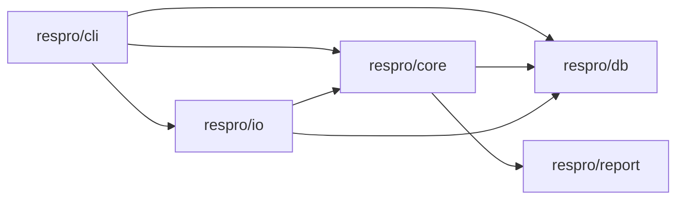
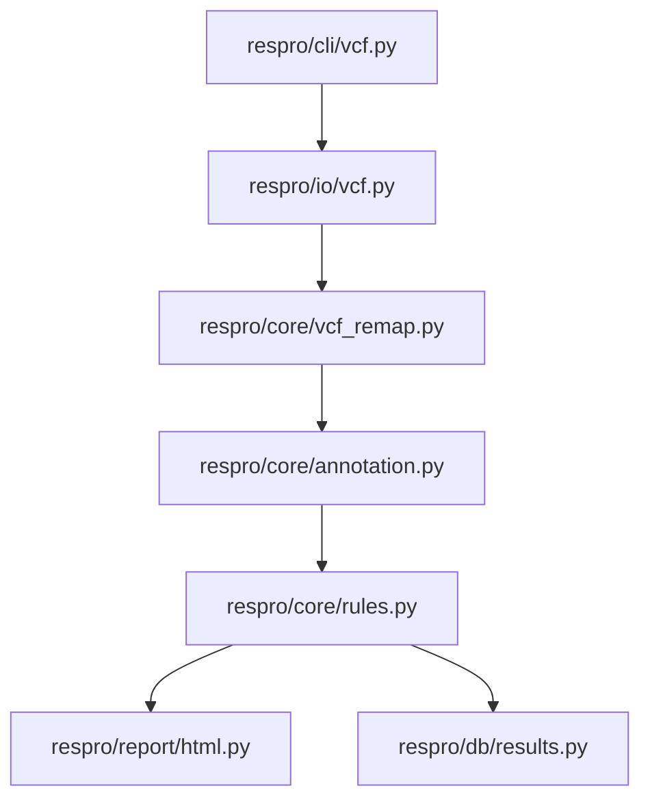
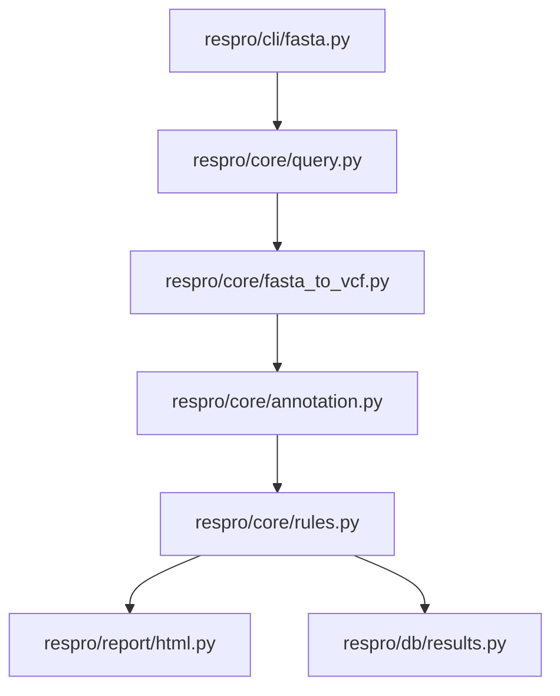
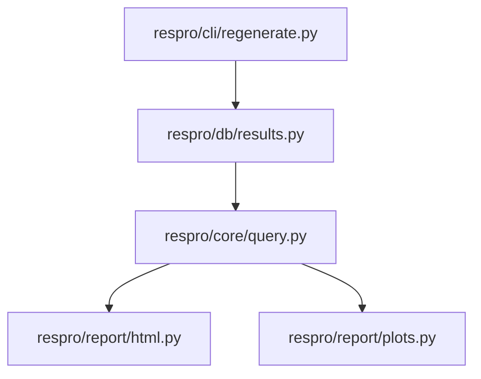

# Detailed Respro Layout

This document captures detailed internal interactions for the CLI-first `respro/` package. It complements `docs/development/contribution-and-architecture.md` and should be updated when module boundaries or cross-module function chains change.

## Update Policy

- Update selectively for architecture-relevant changes.
- Prefer stable module and function labels to reduce churn.
- Keep this file focused on interactions, not implementation trivia.

## Module Interaction Graph

## CLI Entry and Orchestration

Key command families and their primary orchestration modules:

- `respro init` and database setup: `respro/cli/init.py`
- VCF profiling orchestration: `respro/cli/vcf.py`
- FASTA profiling orchestration: `respro/cli/fasta.py`
- Regeneration orchestration: `respro/cli/regenerate.py`
- Classification flow: `respro/cli/classify.py`
- Explore and maintenance commands: `respro/cli/explore.py`, `respro/cli/maintained_db.py`, `respro/cli/sync.py`

## Core Processing Chains

### VCF Profiling Chain

### FASTA Profiling Chain

**Integration note:** The refactored FASTA path now emits nucleotide-level VariantCall records via `fasta_to_vcf()` in `respro/core/fasta_to_vcf.py`, feeding directly into the shared annotation pipeline. Alignment (via `respro/core/alignment.py`) is handled internally by `respro/core/query.py`. This design unifies VCF and FASTA variant interpretation paths.

### Regeneration Chain

## Mutation and Rule Handling Boundaries

- Format parsing and normalization in `respro/io/`
- Biological interpretation and codon-aware consequence logic in `respro/core/`
- Rule persistence and lookup in `respro/db/`
- Rendering/export in `respro/report/`

Do not move mutation interpretation logic into `respro/cli/`.

## Drift Checklist for Changes in respro/

- Were new cross-module edges introduced?
- Did any command family gain direct dependency on an unintended layer?
- Did mutation/rule flow move across module boundaries?
- Do the chain diagrams above still represent the current behavior?
