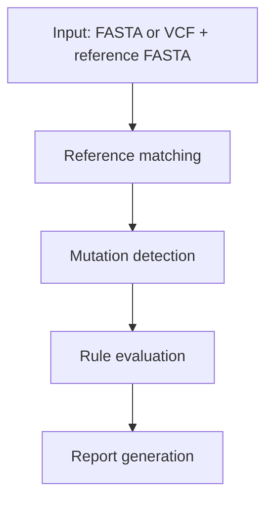

# How It Works

ResistanceProfiler is a framework for building a consistent resistance project database and then profiling new samples against it.

The core idea is that ResPro stores curated rules against internal project references, then maps new FASTA- or VCF-based inputs back into that internal reference space before comparing amino-acid mutations against the rules.

!!! tip "Think of it as a normalization framework"
    Different sample reference spaces go in, one internal project reference space comes out for rule matching.

## Pipeline overview

### Build and use one consistent project database

The project database stores internal references, CDS annotations, and curated resistance rules. All later profiling steps are anchored to this database. References and rules are matched during database creation to ensure internal consistency.

### Input parsing

- **VCF mode** uses a variant file plus a reference FASTA.
- **FASTA mode** uses a consensus sequence directly.

In both modes, input is converted into a common internal representation before rule matching.

#### FASTA-mode specifics

- **IUPAC ambiguity codes** in the consensus sequence are expanded into all possible alternative bases. Each alternative receives a fractional allele frequency derived from equal partitioning (e.g. `R` → A=0.5, G=0.5; `Y` → C=0.5, T=0.5; `N` → A/C/G/T=0.25 each). The reference base is excluded from expansion.
- **N-stretch coverage gaps** — full-NNN codons are treated as non-covered positions and reported as coverage gaps rather than variants. Partial-N codons (1–2 N bases) remain assessable and emit expanded IUPAC variants for the non-N positions.
- **FASTA-mode AF bins** use adjusted thresholds for the discrete IUPAC-derived frequencies: **high** (0.75–1.0), **intermediate** (0.35–0.74), **low** (0.01–0.34).
- **Insertions and deletions** in FASTA mode are detected from alignment gaps (CIGAR-based) between the aligned query and the reference CDS.

### Reference matching and coordinate mapping

Query sequence context is aligned to the internal project references and features. The reference is determined automatically from [minimap2](https://github.com/lh3/minimap2)-based (mappy) CDS matching, and the sequence with the highest identity is selected.

#### CIGAR-based coordinate remapping

For VCF input, variants are defined in user-provided reference coordinates. ResPro uses the CIGAR string from the minimap2 alignment to build a bidirectional coordinate map between query positions and internal CDS positions:

- Each VCF variant position is projected from the user reference into the internal CDS coordinate space.
- REF alleles are verified against the user query FASTA; mismatches produce a warning and the variant is skipped.
- For reverse-strand features, alleles are reverse-complemented to the internal forward strand.
- Anchor-changed indels (where the VCF anchor base differs from the internal reference) are automatically split into a substitution plus a canonical indel before annotation.

### Amino-acid consequence interpretation

Per-feature nucleotide changes are translated into amino-acid consequences. Supported classes include:

- Synonymous
- Missense
- Stop changes
- Frameshift
- Insertion
- Deletion
- Unknown

#### Multiple SNPs in one codon

When two or more SNPs fall within the same codon and all have allele frequency above the combination threshold (default > 0.75, strict greater-than), they are merged into a single combined codon event. The combined codon is translated once, producing one amino-acid consequence instead of separate per-SNP consequences. The allele frequency of the combined event is set to the minimum AF among the member SNPs (conservative lower bound).

SNPs below the threshold are annotated individually. This prevents low-AF variants from being fused with high-AF variants at the same codon.

### Rule matching

- **Single-mutation rules** are matched directly against the observed amino-acid events.
- **Combination rules** evaluate boolean expressions (AND, OR, NOT, XOR) over their atomic member IDs. A member is considered present only when its matched variant has allele frequency **above the member AF threshold** (default > 0.75). This means a partial combination where some members are below threshold does **not** fire the combination rule. When multiple OR branches match, the branch with the highest member AF is selected deterministically (lexical tiebreak on member IDs).
- **Interpretation algorithms** extend rule evaluation with additional logic such as phenotype counting, score-based thresholds, and IC50-based drug interpretation. See [Interpretation Algorithms](algorithms.md) for details.

!!! caution "Reference consistency matters"
    If the sample cannot be mapped confidently to a project reference, downstream rule interpretation will be limited. Keep references and rules biologically consistent.

### Reporting and exports

- HTML report is always generated.
- Optional JSON and PDF exports are available.

### Coverage assessment

Non-covered codon positions are identified differently depending on the input mode:

- **FASTA mode** — any stretch of `N` characters spanning a full codon (`NNN`) is treated as a coverage gap. Each contiguous N-run is reported as a `CoverageGap` entry with the affected feature, codon start, and codon end. Rule positions that fall within a gap are not evaluated.
- **VCF mode with BAM** — an optional BAM file (aligned against the same query reference as the VCF) can be provided via `--bam`. Per-base depth is extracted from the BAM and projected through the CIGAR map onto internal CDS coordinates. Codons where any nucleotide falls below `--min-depth` (default 10) are reported as coverage gaps. This allows the report to flag positions that technically lack sufficient read support even if no variant was called.
- **VCF mode without BAM** — coverage gaps are not assessed; the report assumes all positions targeted by variants are covered.

!!! important "Deterministic regeneration"
    Regeneration workflows depend on the stored run plus a compatible project fingerprint, which keeps report reproduction deterministic.
