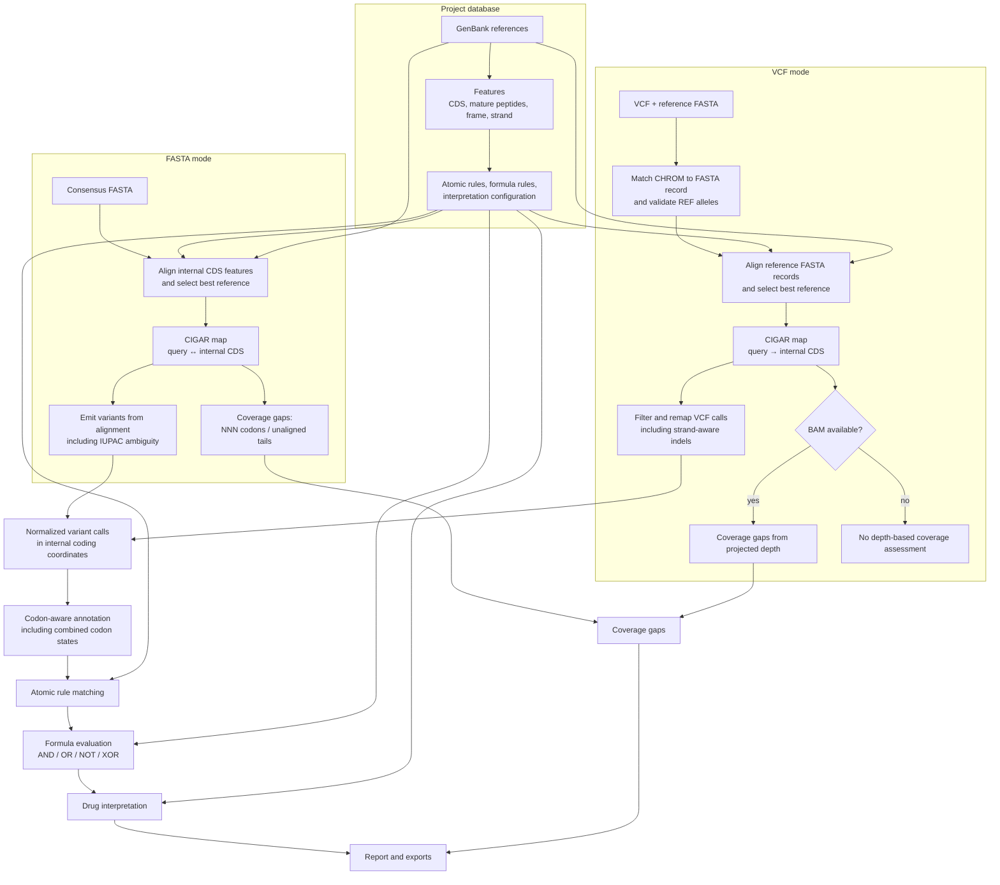

# Technical Reference

This document describes the non-trivial scientific and mathematical logic behind
ResistanceProfiler (ResPro). It is intended as a methods-level reference — the
analogue of a "Methods" section in a scientific publication — and complements the
higher-level [How It Works](how-it-works.md) page. User-facing concerns (CLI flags,
report layout, web app interaction) are intentionally omitted; the focus is on the
internal algorithms, mathematical assumptions, and representation choices that make
the tool scientifically sound.

Throughout, positions are **0-based** unless stated otherwise, and all nucleotide
sequences are stored and manipulated in the **coding (5'→3') orientation**.

---

## Pipeline at a glance

---

## 1. Database construction & representation choices

### 1.1 GenBank as the source of truth

The project database is built from one or more [GenBank](https://www.ncbi.nlm.nih.gov/genbank/)
flat files. Each GenBank record becomes one **internal reference**; each CDS feature
within it becomes one **feature** record. The database is the single coordinate space
against which all subsequent profiling is anchored.

Key representation choices made at import time:

| Stored field | Convention | Rationale |
|---|---|---|
| `feature.start`, `feature.end` | 0-based, half-open `[start, end)` on the **genomic** forward strand | Unambiguous interval algebra; matches Python slicing |
| `feature.strand` | `'+'` or `'-'` | GenBank strand normalised to a binary token |
| `feature.codon_start` | GenBank `codon_start` qualifier **minus 1** (0-based offset) | Translates the 1-based GenBank convention to 0-based |
| `feature.nt_sequence` | CDS nucleotide slice in **coding orientation** (reverse-complemented for `'-'` strand features) | All downstream translation operates on a single orientation |
| `feature.aa_sequence` | Pre-translated protein (stop codon excluded) | Avoids repeated translation; the stored sequence is the reference protein |
| `feature_segment` | Ordered genomic `[start, end)` segments per feature | Supports spliced CDS (multi-exon) features |

### 1.2 Coordinate spaces

ResPro maintains three coordinate spaces and converts between them:

1. **Genomic coordinates** — 0-based positions on the internal reference's forward
   strand. These are what the database stores for feature boundaries.
2. **CDS coordinates** — 0-based offsets along the coding sequence (concatenated exons
   in coding orientation). The first coding nucleotide after `codon_start` is CDS
   position 0.
3. **Query coordinates** — 0-based positions on the user-supplied input sequence
   (FASTA consensus or VCF reference).

The conversion between genomic and CDS coordinates is governed by the feature's
strand and segment structure:

=== "Forward strand (`'+'`)"

    For a single-segment feature spanning genomic `[s, e)`:

    $$\text{CDS}(g) = g - s$$

    For multi-segment (spliced) features, CDS offsets accumulate across segments
    in genomic order:

    $$\text{CDS}(g) = \sum_{j < i} (e_j - s_j) + (g - s_i) \quad \text{where } g \in [s_i, e_i)$$

=== "Reverse strand (`'-'`)"

    For a single-segment feature spanning genomic `[s, e)`:

    $$\text{CDS}(g) = (e - 1) - g$$

    The coding orientation reads right-to-left on the genomic forward strand, so
    the highest genomic position in the feature maps to CDS position 0. For
    multi-segment features, segments are processed in **reversed genomic order**
    (last segment first), and within each segment the same $(e-1)-g$ mapping applies.

The inverse mapping $\text{Genomic}(c)$ follows by inverting these formulae segment
by segment.

### 1.3 Rule storage

Resistance rules are stored as amino-acid-centric records keyed by
`(feature_name, position)` where `position` is a 0-based codon index within the
feature's protein. Each rule carries a `reference` (reference amino acid) and
`mutation` (alternate amino acid or indel token), plus optional phenotype, IC50,
fold-IC50, score, and publication metadata.

Formula (combination) rules are stored separately with a normalised boolean
expression string and a link table to their atomic member rules. The expression
is stored in a **canonical form** (see [§6](#6-boolean-formula-evaluation-ast))
for duplicate detection.

### 1.4 Mutation token normalisation

Rules TSV files accept a variety of notation styles. At import time, every
mutation token is normalised to one of five **canonical forms**:

| Canonical form | Meaning | Example input → output |
|---|---|---|
| `V` | Specific alt amino acid (missense, synonymous, stop-loss target) | `F67L` → `L` |
| `*` | Stop gained | `F67stop`, `*` → `*` |
| `fsX` | Frameshift at this codon | `F67fs`, `frameshift` → `fsX` |
| `F50FGG` | Insertion: insertion after F50 resulting in `FGG` | `F50insGG` → `F50FGG` |
| `FGG50F` | Deletion: deletion from `FGG` to `F` at anchor position 50 | `F50delGG` → `FGG50F` |

The normaliser accepts:

- **HGVS-like insertion notation**: `X<pos>ins<AA>` or `X<pos>_Y<pos+1>ins<AA>`
  → `X<pos>X<AA>` (anchor + inserted amino acids).
- **HGVS-like deletion notation**: `X<pos>del<AA>` → `X<AA><pos>X` (anchor +
  deleted block + anchor position).
- **Rewrite notation**: `X<pos>Y` where X and Y are amino-acid strings. If
  `len(X) == len(Y) == 1`, it is a substitution (stored as `Y`). If
  `Y.startswith(X)` and `len(Y) > len(X)`, it is an insertion. If
  `X.startswith(Y)` and `len(X) > len(Y)`, it is a deletion.
- **Bare tokens**: a single amino-acid letter (substitution), `*` / `stop`
  (stop gained), `fs` / `frameshift` (frameshift), `INS_any` (wildcard
  insertion matching any in-frame insertion at this position).
- **Anchor-less deletion**: tokens like `Q35del` (no anchor residue) are
  resolved by fetching the preceding amino acid from the feature's stored
  protein sequence and constructing the canonical anchored form.

**Anchor-changed indel rule splitting.** A rule like `GY50A` encodes both an
anchor substitution (G→A at position 50) and an indel (deletion of Y). At import
time, such tokens are **split** into two separate rule rows: a substitution
(`G50A`) and a canonical indel (`G50G`), each with a derived `member_id` suffixed
`__sub` and `__indel`. This mirrors the VCF-mode anchor-changed indel splitting
(see [§4.3](#43-anchor-changed-indel-splitting)) and ensures both events are
independently matchable.

### 1.5 Coordinate-base detection

Rules TSV files may use either 0-based or 1-based amino-acid positions. ResPro
**auto-detects** the coordinate base by comparing the `reference` column against
the pre-translated `aa_sequence` stored for each feature:

- For each verifiable row (one with a reference AA, a position, and a matching
  feature), check whether the reference AA matches `aa_seq[pos - 1]` (1-based)
  or `aa_seq[pos]` (0-based).
- The coordinate base with more matches wins. Ties default to 1-based (the
  standard biochemistry convention).
- If neither system matches any verifiable row, a `ValueError` is raised — the
  rules file's reference AAs do not match the GenBank sequences.

After detection, all positions are converted to 0-based for storage, and every
rule's reference AA is **validated** against the feature's protein sequence.
Mismatches and out-of-range positions are logged as warnings and the offending
rules are skipped.

### 1.6 mat_peptide features

In addition to CDS features, ResPro imports GenBank `mat_peptide` (mature
peptide) annotations as first-class features. Each mat_peptide is linked to its
parent CDS via `parent_feature_name` (the containing CDS determined by genomic
containment on the same strand). This allows rules to target specific proteolytic
cleavage products rather than the full polyprotein — important for viruses like
HIV or HCV where resistance mutations are defined in the context of mature
protein domains.

mat_peptide features carry their own `nt_sequence`, `aa_sequence`, `codon_start`,
and segment structure, extracted and translated independently of the parent CDS.
In the report, mat_peptide features display their `protein` name (the GenBank
`product` qualifier) rather than their feature `name`, so the user sees
biologically meaningful domain names.

---

## 2. Reference matching via minimap2

### 2.1 Alignment strategy

ResPro does not re-invent sequence alignment. It delegates to
[**minimap2**](https://github.com/lh3/minimap2) via its Python binding
[`mappy`](https://github.com/lh3/minimap2/tree/master/python). The alignment
strategy is inverted from the typical use case: instead of mapping reads against
a reference genome, ResPro **indexes the user's query sequence** and then maps
each **internal CDS** against that index as a query.

This inversion is deliberate:

- The query (consensus or whole-genome) is typically much longer than any
  individual CDS, so indexing the query and mapping short CDS queries against it
  is efficient.
- Each CDS is aligned independently, allowing per-feature identity and coverage
  assessment.
- The best-scoring primary alignment for each CDS determines the feature match.

The alignment preset is `map-ont` (optimised for Oxford Nanopore reads, but
effective for divergent consensus sequences at ~60–75% identity), with a reduced
seed length ($k=6$, $w=3$) for sensitivity on short, divergent CDS sequences.
The gap-open penalty is raised from the `map-ont` default (4 → 6) to suppress
compensating indel pairs — adjacent `I`/`D` operations in the CIGAR that
represent a single divergence event — without losing real indels.

### 2.2 Identity and coverage metrics

For each CDS-to-query alignment, ResPro computes three metrics:

- **Identity** — the fraction of matching bases over the aligned block length:

    $$\text{identity} = \frac{\text{mlen}}{\text{blen}}$$

    where `mlen` is the number of matching bases (mappy's match count) and
    `blen` is the alignment block length (excluding soft-clipping). For spliced
    features with classified introns, identity is recomputed over exons only
    (see [§3.3](#33-intron-classification-for-spliced-genes)).

- **CDS coverage** — the fraction of the CDS coding span that is aligned:

    $$\text{cds\_coverage} = \frac{\text{aligned\_exon\_length}}{\sum_{\text{segments}} (e_j - s_j)}$$

    clamped to $[0, 1]$.

- **Query coverage** — the fraction of the query sequence spanned by the
    alignment:

    $$\text{query\_coverage} = \frac{r_{\text{en}} - r_{\text{st}}}{|Q|}$$

The **best reference** for a query is selected as the reference of the
single best feature match, ranked by identity (descending), then CDS coverage
(descending), then query coverage (descending), then feature name
(lexicographic, ascending) as a deterministic tiebreaker.

---

## 3. CIGAR parsing & coordinate mapping

### 3.1 CIGAR convention

A [CIGAR](https://samtools.github.io/hts-specs/SAMv1.pdf) string encodes the
alignment between two sequences as a sequence of `(length, operation)` pairs.
ResPro uses the standard SAM operations:

| Op | Meaning | Consumes CDS | Consumes query |
|---|---|:---:|:---:|
| `M` | Match/mismatch | ✓ | ✓ |
| `I` | Insertion in query (gap in CDS) | ✗ | ✓ |
| `D` | Deletion in query (gap in CDS) | ✓ | ✗ |

(`S`, `H`, `N`, `P`, `=`, `X` are not emitted by the mappy pipeline path.)

**Convention swap.** Mappy reports CIGAR in the orientation
*feature = query, genome = reference*. ResPro's pipeline uses the opposite
convention — *CDS = reference, genome = query* — so `I` and `D` are swapped
upon import. For reverse-strand alignments, the CIGAR operation order is also
reversed so that it walks the coding sequence in 5'→3' order.

### 3.2 Bidirectional coordinate map

The CIGAR is walked to build a **CDS-position → query-position** map. For each
`M` operation of length $L$, $L$ consecutive CDS positions are paired with
consecutive query positions. `I` operations advance only the query position
(those CDS positions have no query counterpart). `D` operations advance only the
CDS position (those CDS positions map to `None`, indicating a deletion in the
query).

This map is **inverted** for VCF-mode remapping (query-position → CDS-position),
allowing variant positions defined on the user's reference to be projected into
internal CDS coordinates.

For spliced features, the exon-only CIGAR (introns removed, see below) produces
a map that ignores intron query spans. Each mapped query position is then
**shifted past** the cumulative length of all introns whose coding-orientation
start precedes it, so that exon-2 (and later) CDS positions land at the correct
offset in the full unspliced query. Positions that fall inside an intron span
after shifting are excluded (`None`), so variants inside introns are never
remapped.

### 3.3 Intron classification for spliced genes

When a project feature is a spliced CDS (multiple segments in `feature_segment`)
and the user supplies an unspliced whole-genome query, minimap2 reports the
inter-exon intron as a single large `I` operation (in the swapped convention:
the intron bases appear as an insertion in the query). Without special handling,
this intron would be misinterpreted as a giant coding insertion — a
multi-kilobase frameshift — and would crash per-exon identity.

ResPro classifies each `I` op as an **intron** when **both** conditions hold:

1. **Junction proximity**: the `I` op's CDS position coincides with a known
   exon-junction offset within a tolerance $\tau$ (default 5 nt).
2. **Length guard**: the `I` op's length is strictly greater than $\tau$.

Exon-junction offsets are derived from `feature.segments` in **genomic 5'→3'
order** (not coding order), matching the normalised CIGAR's walking direction
for both strands. The junction offset after exon $j$ is:

$$J_j = \sum_{i \le j} (e_i - s_i)$$

Classified intron `I` ops are **removed** from the CIGAR (producing an
exon-only CIGAR) and recorded as `IntronInterval` entries carrying the CDS
junction position, the query span, and the length. Real coding insertions —
any `I` op not near a junction within tolerance, or of length $\le \tau$ — are
kept and emitted as variants.

The length guard being derived from $\tau$ (rather than a separate parameter)
ensures that an insertion of length $\le \tau$ can **never** be misclassified as
an intron, regardless of where it lands, while real introns (typically hundreds
or thousands of nucleotides) always satisfy the guard.

---

## 4. Variant emission & remapping

### 4.1 FASTA mode: consensus → variant calls

In FASTA mode, the user supplies a consensus sequence. ResPro reconstructs a
gapped pairwise alignment between the internal CDS and the query region using
the CIGAR, then walks the alignment codon by codon to emit nucleotide-level
`VariantCall` records.

**Gapped string reconstruction.** The CIGAR is expanded into two equal-length
strings (`aligned_ref` and `aligned_query`) with `-` gap characters. Leading
and trailing unaligned CDS bases (when coverage < 100%) are represented as
query gaps, so the codon walk covers the full CDS.

**SNP emission with IUPAC expansion.** When the query base differs from the
reference base, [IUPAC ambiguity codes](https://en.wikipedia.org/wiki/Nucleic_acid_notation#IUPAC_nucleotide_code)
are expanded into all possible alternative bases. Each mutation ALT receives a
**fractional allele frequency** of $1 / |O|$ where $O$ is the full IUPAC option
set (including the reference base as one equally-likely possibility):

$$f_{\text{alt}} = \frac{1}{|O|}$$

For example, `ref=A, query=R` (R = {A, G}) yields `G` at AF 0.5; `ref=A,
query=N` (N = {A, C, G, T}) yields `C`, `G`, `T` each at AF 0.25. The
reference base is included in the denominator because it is one of the
equally-likely possibilities (= no mutation), but it is not emitted as an ALT.

**Coverage gaps.** A codon consisting entirely of `N` characters (`NNN`) is
treated as a non-covered position and reported as a `CoverageGap` rather than
emitting variants. Partial-N codons (1–2 N bases) remain assessable: the non-N
positions emit expanded IUPAC variants normally.

**Indel emission.** Insertions (query bases with no CDS counterpart, i.e. `I`
ops) and deletions (CDS bases with no query counterpart, i.e. `D` ops) are
accumulated into single variant records using VCF anchor-base convention (the
base preceding the indel is included in both REF and ALT).

### 4.2 VCF mode: coordinate remapping

In VCF mode, variants are already called by an external variant caller and
defined in the user's reference coordinates. ResPro **remaps** each variant into
internal CDS coordinates using the inverted CIGAR map.

The remap pipeline performs, per variant:

1. **Position projection.** The variant's query position is looked up in the
   query-to-CDS map. Positions outside any matched CDS region are skipped.

2. **REF sanity check.** The VCF `REF` anchor base is compared to the
   corresponding base in the user's query FASTA. A mismatch produces a warning
   and the variant is skipped — this catches VCF/FASTA reference mismatches
   early.

3. **Strand transformation.** When the alignment strand differs from the
   feature strand, REF and ALT alleles are transformed to the internal forward
   strand:
   - **SNPs**: the single base is complemented.
   - **Indels**: the anchor base is complemented and the payload is
     reverse-complemented. The anchor also **switches side** (from leftmost to
     rightmost or vice versa) because the VCF convention anchors the leftmost
     base in genomic 5'→3' order, but the internal forward reference needs the
     coding-preceding base as anchor.

4. **CDS-to-genomic conversion.** The CDS position is converted to an internal
   genomic position via $\text{Genomic}(c)$.

5. **Query codon context.** The three-base query codon surrounding the variant
   is extracted and stored on the remapped variant. For reverse-strand
   alignments, the codon is complemented to coding orientation. This context
   allows downstream annotation to use the **query** codon (which may carry
   co-occurring variants) rather than the internal reference codon alone.

### 4.3 Anchor-changed indel splitting

Some variant callers encode a base substitution at the VCF anchor together with
an indel, e.g. `ATTT → G` (anchor `A` changed to `G`, plus a deletion of
`TTT`). Left as one event, the anchor substitution signal would be lost during
strand-aware remap. ResPro **splits** such records deterministically into two
events:

1. **Anchor SNP**: `A → G` at the same query position.
2. **Canonical indel**: `ATTT → A` (anchor reset to the REF anchor base).

Both split events inherit the original record's allele frequency, depth, and
filter status, and preserve the original user-reference coordinates for display.

---

## 5. Codon-aware annotation

The annotation module is the scientific heart of ResPro. It takes
nucleotide-level variant calls and produces amino-acid-level consequences. Both
FASTA and VCF modes converge on the same annotation function — the input
representation is identical by design.

### 5.1 Single-SNP annotation

For a SNP at CDS position $c$ within a feature:

1. The **codon index** is $i = \lfloor (c - \text{codon\_start}) / 3 \rfloor$
   and the **position within the codon** is $p = (c - \text{codon\_start}) \bmod 3$.
2. The **reference codon** is extracted from the internal CDS. If a valid
   query codon context is available (from VCF remap), it is used as the
   reference for amino-acid derivation; otherwise the internal CDS codon is used.
3. The **alternate codon** is constructed by replacing position $p$ with the
   ALT base (in coding orientation — reverse-complemented for `'-'` strand
   features).
4. Both codons are translated via the [standard genetic code](https://en.wikipedia.org/wiki/DNA_codon_table)
   (Biopython's `Seq.translate`), and the consequence is classified:

    | Condition | Consequence |
    |---|---|
    | `ref_aa == alt_aa` | synonymous |
    | `codon_idx == 0` and `ref_aa == 'M'` | start_lost |
    | `alt_aa == '*'` and `ref_aa != '*'` | stop_gained |
    | `ref_aa == '*'` | stop_loss |
    | otherwise | missense |

### 5.2 Indel annotation

Indels use the [VCF anchor-base convention](https://samtools.github.io/hts-specs/VCFv4.2.pdf):
the nucleotide immediately preceding the indel is included in both REF and ALT.
For example, a 3-bp insertion after position 100 is encoded as `REF=A,
ALT=ATTT`.

**Frame check.** If $|\text{len(ALT)} - \text{len(REF)}| \bmod 3 \ne 0$, the
indel is not a multiple of 3 and is annotated as a **frameshift**. The
annotation records the anchor codon's amino acid and produces the canonical
frameshift token `XfsX` (e.g. `KfsX` for a frameshift after a lysine).

**In-frame indels at codon boundaries.** When the indel length is a multiple of
3 and the VCF anchor sits at a codon boundary (frame offset 2 in coding
orientation), the annotation is straightforward:

- **Insertion**: `alt_aa = anchor_aa + translate(inserted_bases)`
- **Deletion**: `ref_aa = anchor_aa + translate(deleted_bases)`,
  `alt_aa = anchor_aa`

For `'-'` strand features, the inserted/deleted bases are reverse-complemented
before translation to ensure coding orientation.

**Mid-codon in-frame indels.** When an in-frame indel starts mid-codon (frame
offset 0 or 1), the anchor codon is partially rewritten. ResPro splits the
event into two annotations:

1. A **missense** (or synonymous/stop) annotation for the anchor codon change,
   reconstructed from the preserved reference bases plus the first few
   inserted/deleted bases.
2. An **insertion** or **deletion** annotation for the remaining payload.

This splitting ensures that both the codon rewrite and the indel payload are
visible to rule matching.

**Reverse-strand indel anchor switching.** On `'-'` strand features, the VCF
leftmost anchor in genomic space corresponds to the **rightmost** base in
coding orientation. The coding anchor position is shifted by the REF length to
realign to the coding-preceding nucleotide:

$$c_{\text{anchor}} = c_{\text{variant}} - \text{len(REF)} \quad \text{('−' strand)}$$

### 5.3 Multiple SNPs in one codon — Fréchet bounds

When two or more SNPs fall within the same codon at distinct nucleotide
positions, ResPro does not simply translate each SNP independently. Instead, it
uses **Fréchet (probability) bounds** to determine which combined codon states
are guaranteed to exist in the viral population, and emits per-SNP annotations
carrying the accepted combined states.

This is the **no-BAM path**: it is taken when no alignment file is supplied
(`--bam` omitted), so only the marginal VCF allele frequencies are available.
When a BAM is supplied, the exact co-occurrence path of [§5.4](#54-bam-based-exact-co-occurrence)
is used instead and the Fréchet bounds are not computed.

#### 5.3.1 The mathematical problem

Consider a codon with $k$ distinct variant-bearing nucleotide positions
($k = 2$ or $3$). At each position $i$, a variant is observed at marginal
allele frequency $f_i$. The question is: **which exact codon states are
guaranteed to co-exist in the population**, given only the marginal
frequencies?

This is a problem of bounding the intersection of events from their marginal
probabilities. The [Fréchet inequalities](https://en.wikipedia.org/wiki/Fr%C3%A9chet_inequalities)
provide sharp bounds on the probability of a joint event given the marginal
probabilities, without any assumption of independence or linkage.

For a candidate codon state $S$ that carries variant $i$ at a subset of the $k$
positions, define:

$$q_i = \begin{cases} f_i & \text{if } S \text{ carries variant } i \\ 1 - f_i & \text{otherwise} \end{cases}$$

The **Fréchet lower bound** (minimum guaranteed co-occurrence) is:

$$\boxed{L(S) = \max\!\left(0,\; \sum_{i=1}^{k} q_i - (k - 1)\right)}$$

The **Fréchet upper bound** (maximum possible co-occurrence) is:

$$\boxed{U(S) = \min_{i=1}^{k} q_i}$$

These bounds are **sharp**: there exist joint distributions achieving both
extremes, so no tighter bounds can be derived from the marginals alone.

#### 5.3.2 State enumeration

ResPro enumerates all $2^k$ candidate codon states (the Cartesian product of
{reference, ALT} at each variant-bearing position). For each state $S$:

1. Build the candidate codon by applying the chosen ALT bases.
2. Compute $L(S)$ and $U(S)$.
3. Compute the **forced fraction** — the minimum fraction of the rarest
   required condition forced into this state:

    $$F(S) = \begin{cases} \dfrac{L(S)}{U(S)} & \text{if } U(S) > 0 \\[6pt] 0 & \text{otherwise} \end{cases}$$

4. The state is **accepted** when $L(S) > \varepsilon$ (numerical tolerance,
   $10^{-9}$) and $F(S) \ge \mu$, where $\mu$ is the minimum co-occurrence
   fraction (default $2/3$, see below).

#### 5.3.3 The acceptance threshold

The threshold $\mu = 2/3$ is an **explicit conservative interpretation policy**.
Passing means the guaranteed shared portion is at least twice the potentially
unshared portion:

$$\frac{L}{U} \ge \frac{2}{3} \implies L \ge 2(1 - F_{\text{unshared}})$$

At $\mu = 2/3$, two variants each at $f = 0.75$ give:

$$L = \max(0, 0.75 + 0.75 - 1) = 0.5, \quad U = 0.75, \quad F = \frac{0.5}{0.75} = \frac{2}{3}$$

This is exactly at the acceptance boundary. Three-way combinations require
stronger individual frequencies; for example, three variants at $f = 0.75$
each give $L = \max(0, 3 \times 0.75 - 2) = 0.25$, $U = 0.75$,
$F = 1/3 < 2/3$, which is **rejected**.

!!! important "What Fréchet bounds do and do not mean"
    The Fréchet lower bound is the **minimum guaranteed** population share of
    the exact codon state, derived purely from marginal frequencies. It is:

    - **Not** a probability that the variants are physically linked (phase is
      unknown).
    - **Not** a phasing estimate.
    - **Not** an independence assumption (independence would give a different,
      non-sharp bound).

    It is the tightest statement that can be made from the marginals alone.

#### 5.3.4 Per-SNP emission with combined states

For each member SNP, ResPro emits one annotation carrying:

- Its own `allele_freq`, `ref`, and `alt`.
- A **single-exchange** `alt_codon`/`alt_aa` — the codon with only that SNP
  applied.
- A `combined_states` list of the Fréchet-accepted codon states that include
  this member, deduplicated by amino acid (summing `lower` for duplicates).

The `single_exchange_lower` field records the guaranteed minimum population
share of the exact single codon displayed in that row. When the single state is
Fréchet-impossible ($L = 0$), the single-exchange effect is gated to zero in
rule matching — only combined states can fire.

#### 5.3.5 Forced-overlap exception

When a member's single-exchange state is Fréchet-rejected ($L \le \varepsilon$)
but there exists an accepted **all-carried** state with $F = 1.0$ (meaning the
Fréchet overlap is 100%, which occurs when a co-member is at frequency 1.0),
the member's single `alt_codon`/`alt_aa` is **promoted** to the forced
all-carried state. This reflects the biological reality that a variant at
frequency 1.0 is present in every genome, so any co-occurring variant is
guaranteed to sit on the same background. The promoted state is dropped from
`combined_states` to avoid showing the same effect twice.

#### 5.3.6 Fallback

When the Fréchet helper returns no states (multiallelic same-position inputs,
where two ALTs at the same codon position cannot form valid combined states)
or no accepted state exists for any member, ResPro falls back to plain
single-SNP annotation with no `combined_states`.

### 5.4 BAM-based exact co-occurrence

When the user supplies an alignment file with `--bam`, the Fréchet bound path
of §5.3 is **not taken at all**. Instead, ResPro measures the exact
co-occurrence frequency of each combined codon state directly from the reads
that span the codon. This replaces the conservative lower-bound estimate with
an observed frequency.

#### 5.4.1 Shared candidate-state enumeration

Both paths share the same candidate-state enumeration
(`enumerate_candidate_codon_states`). For every variant-bearing nucleotide
position in the codon, the enumerator builds the cartesian product of
{reference base, each ALT}. Each resulting `CandidateCodon` carries the
combined alt codon, its amino acid, the member indices it spans, the per-base
choice encoding, and the per-base VCF quality values. This shared state space
keeps the two paths numerically comparable.

#### 5.4.2 Spanning-molecule counting

For each candidate codon state, `compute_codon_cooccurrence` counts reads that
span all variant-bearing positions of the codon:

1. **Primary-alignment filter.** Only primary alignments are assessed;
   secondary (`0x100`) and supplementary (`0x800`) records are skipped. This
   keeps each `query_name` group to at most the two mates of a proper pair, so
   a single molecule is never double-counted via an alternative mapping and a
   supplementary that disagrees with its primary cannot reject a genuine
   primary observation through the paired-end agreement rule (step 3).
2. **QC filter.** Reads flagged QCFAIL (`0x200`) or duplicate (`0x400`) are
   excluded — they do not represent independent molecules and would inflate
   the co-occurrence frequency.
3. **MAPQ filter.** Only reads with mapping quality ≥
   `codon.min_read_mapping_quality` (default 20) are considered.
4. **Spanning requirement.** A read must cover every variant-bearing
   nucleotide position of the codon; partial-span reads (including reads whose
   codon region is soft-clipped or partly trimmed) are discarded for that
   codon's count.
5. **Paired-end deduplication and agreement.** For a paired read whose mate
   also spans the codon, the pair is counted once and only when both mates
   agree on the called base at every variant position; disagreements (likely
   sequencing errors) are discarded.
6. **State frequency.** The observed frequency of a candidate state is
   `spanning molecules matching the state / total spanning molecules at the codon`
   (a *molecule* is a single-end read or a deduplicated paired-end pair; see
   step 5).

Unlike the Fréchet path, the BAM path applies **no frequency threshold** to
individual candidate states. Every candidate state with at least one observed
spanning molecule is **accepted** and emitted as a `CodonState` with
`lower = upper = observed frequency` and `forced_fraction = 1.0` (a point
estimate, not a bound). The sole acceptance filter is the spanning-molecule
count itself: when fewer than `codon.min_depth` molecules span the codon, no
combined call is made at all (see §5.4.3). Reads whose codon matches no
candidate (a base not present in the VCF at a variant position) are tallied as
"other" — they contribute to the spanning-molecule denominator but produce no
`CodonState`, so a rare off-VCF base cannot inflate a candidate's frequency.

#### 5.4.3 Thin-evidence → single-event fallback

When fewer than `codon.min_depth` molecules span the codon, ResPro falls back
to plain single-SNP annotation with no `combined_states` (`freq_method` stays
`'observed'`) — the same single-event fallback as §5.3.6. This is the intended
reading of thin evidence: the raw reads were inspected for co-occurrence and
found too sparse to support a combined claim, so none is made. (A codon that
*is* spanned at or above `min_depth` but where every molecule is "other" also
yields no `CodonState` and falls back to single events.)

#### 5.4.4 Provenance: `freq_method`

Each annotated variant carries a `freq_method` provenance flag:

- `observed` — the amino-acid frequency value shown is the frequency itself
  (single-nt VCF allele frequency, or a BAM read-backed codon state).
- `estimated` — the amino-acid frequency is a guaranteed minimum (lower bound)
  for a combined codon without read-level data (the Fréchet path of §5.3); the
  true frequency may be higher.

The report surfaces this as a user-facing tag on every amino-acid effect:
`K20M | 0.7 | observed` vs `K20M | 0.6 | lower bound`. The term "Fréchet" is
not shown in the report; the legend explains that *observed* is the frequency
value itself, while *lower bound* is a guaranteed minimum that the true
frequency may exceed (no linkage/phase assumption). The `freq_method` field
keeps its `'observed'`/`'estimated'` values in the database; only the
display tag differs.

---

## 6. Boolean formula evaluation (AST)

### 6.1 Grammar & parser

Combination rules are boolean expressions over atomic rule IDs (external IDs of
single rules). ResPro implements a **recursive descent parser** with explicit
operator precedence to build an abstract syntax tree (AST). The grammar is:

$$
\begin{aligned}
\text{or\_expr} &::= \text{xor\_expr} \;\;(\texttt{OR}\;\; \text{xor\_expr})^* \\
\text{xor\_expr} &::= \text{and\_expr} \;\;(\texttt{XOR}\;\; \text{and\_expr})^* \\
\text{and\_expr} &::= \text{not\_expr} \;\;(\texttt{AND}\;\; \text{not\_expr})^* \\
\text{not\_expr} &::= \texttt{NOT}\;\; \text{not\_expr} \;\;|\;\; \text{primary} \\
\text{primary} &::= \texttt{(}\;\text{or\_expr}\;\texttt{)} \;\;|\;\; \text{ATOM}
\end{aligned}
$$

**Precedence** (lowest to highest):

$$\texttt{OR} < \texttt{XOR} < \texttt{AND} < \texttt{NOT} < \text{parentheses/atoms}$$

This means `A AND B OR C` is parsed as `(A AND B) OR C`, and `NOT A AND B` is
parsed as `(NOT A) AND B`.

Each precedence level has its own parsing function that calls the next
higher-precedence function for its operands, building the tree bottom-up. The
parser produces:

1. A **canonical normalised string** (for duplicate detection and stable
   storage).
2. A list of all referenced atomic rule IDs.

### 6.2 Canonicalisation

The AST is canonicalised for deterministic storage and duplicate detection:

- **Flattening**: nested same-operator nodes are merged into a single node with
  a list of children. `A AND (B AND C)` becomes `AND(A, B, C)`.
- **Sorting**: children are sorted by a stable key that keeps positive branches
  before negated branches, then by lexical order of the serialised subtree.
- **Serialisation**: the canonical AST is serialised with explicit parentheses,
  e.g. `(A AND B) OR C`.

This canonical form is what is stored in the database and used for the
uniqueness constraint on `(drug_id, normalised_expression)`.

### 6.3 Runtime evaluation

At profiling time, each formula rule is evaluated against the set of matched atomic members. The evaluation re-parses the canonical expression and walks the AST with the same recursive descent structure, but each function returns a `(truth, contributors)` pair instead of a node:

| Operator | Truth logic | Contributor logic |
|---|---|---|
| `ATOM` | `member_truth[id]` | `{id}` if true, else `∅` |
| `NOT` | `¬operand` | `∅` (NOT contributes no positive evidence) |
| `AND` | `left ∧ right` | `left ∪ right` if both true, else `∅` |
| `XOR` | `left ⊕ right` | the true side's contributors |
| `OR` | `left ∨ right` | deterministic branch selection (see below) |

**Member gating (Fréchet).** A member contributes only when its matched effect's amino-acid frequency lower bound (`rule_effect_aa_freq`) exceeds eps (`[matching] frechet_epsilon`, default $10^{-9}$) — the same amino-acid-frequency basis single rules use, not the nucleotide allele frequency. When multiple annotations match the same member ID, the one with the highest effect lower bound is selected (lexical tiebreak on `(feature_name, codon_pos, alt_aa)` for determinism).

**AND gating (Fréchet joint bound).** An AND clause fires only when the joint Fréchet lower bound over its positive members is accepted at `[matching] min_cooccurrence_combination_fraction` (default $2/3$): with member lower bounds $q_1,\dots,q_k$, the guaranteed co-occurrence lower bound is $\max(0, \sum q_i - (k-1))$, the upper bound is $\min(q_i)$, and the forced fraction is $\text{lower}/\text{upper}$. The hit frequency reported for the combination is the joint lower bound — a guaranteed minimum, not a point estimate.

**OR branch selection.** When multiple OR branches are accepted, the branch with the **highest member lower bound** is selected as the contributor; ties are broken lexicographically by the sorted tuple of member IDs. The reported frequency is that branch's lower bound.

**XOR parity.** XOR chains fire when an odd number of operands are accepted. With exactly one accepted operand the frequency is that operand's lower bound; with three or more it is the Fréchet AND-bound over all accepted operands' lower bounds.

**NOT.** NOT is a pure boolean inversion over presence (including compound operands); it never carries a frequency. A formula that fires only via a NOT branch reports a frequency of 0.

**Worked examples** (AND of two members, min fraction $2/3$):

| Member lower bounds | Joint lower | Upper | Forced fraction | Result |
|---|---|---|---|---|
| 0.95, 0.95 | 0.90 | 0.95 | 0.947 | fires, frequency 0.90 (`high` bin) |
| 0.95, 0.30 | 0.25 | 0.30 | 0.833 | fires, frequency 0.25 (`intermediate` bin) |
| 0.60, 0.60 | 0.20 | 0.60 | 0.333 | rejected (0.333 < 2/3) |
| 0.95, 0.02 | 0.00 | 0.02 | 0.000 | rejected (lower bound 0) |

**Equivalence with the codon policy.** The formula AND bound is the same Fréchet-intersection computation the combined-codon path uses (`_compute_codon_frechet_states`): at equal thresholds both paths accept exactly the same q-vectors (asserted by cross-validation test). The thresholds and numerical tolerances are decoupled — the codon policy uses `[codon] min_cooccurrence_codon_fraction` with `[codon] frechet_epsilon`, formula gating uses `[matching] min_cooccurrence_combination_fraction` with `[matching] frechet_epsilon` — so the two sensitivities can be tuned independently.

**Reported-frequency semantics.** The frequency reported for a formula hit is the joint Fréchet lower bound — a guaranteed minimum on how often the members co-occur, not a point estimate of the true combination frequency. The AF bin shown in the report reflects this lower bound, so a fired formula can show an `intermediate` or `low` bin even though every member individually fired at a `high` frequency.

---

## 7. Rule matching

### 7.1 Single-rule matching

Single rules are indexed by `(feature_name, codon_pos)` and matched against
annotated variants at the same key. The matching logic depends on the
consequence type:

| Rule type | Match condition |
|---|---|
| SNP (1-letter ref, 1-letter mut) | `ann.alt_aa == rule.mutation` |
| Insertion (mut longer than ref) | inserted payload matches (anchor-agnostic) |
| Deletion (ref longer than mut) | deleted payload matches (anchor-agnostic) |
| Frameshift | both rule and annotation are frameshift tokens |
| `INS_any` wildcard | `ann.consequence == 'insertion'` |

**Fréchet gating.** For combined codon events, the single-exchange effect is
gated by `single_exchange_lower > 0`. A combined member whose single state is
Fréchet-impossible cannot match a single-amino-acid rule — only its
Fréchet-accepted combined states can fire. Each accepted combined state adds
its own `alt_aa` candidate, gated by its Fréchet `lower` bound. A
combined-state hit takes precedence for the display frequency: the
combinatorial effect's Fréchet lower bound is what the report shows.

**Indel anchor agnosticism.** Insertion and deletion rules are matched by
**payload only**, not by the anchor amino acid. This makes rules robust to
anchor-frame differences between the rule curator's reference and the sample.
A warning is emitted when the anchor amino acids differ.

**`INS_any` suppression.** When a specific insertion rule fires at the same
position and drug as an `INS_any` wildcard rule, the wildcard is suppressed to
avoid redundant hits.

### 7.2 Ruleless feature suppression

Features without resistance rules that overlap a ruled feature on the same
reference are **suppressed** — their annotations are dropped. This prevents
ruleless features (e.g. an overlapping upstream ORF) from shadowing variants
that belong to the ruled feature. Overlap is evaluated per reference using
half-open interval algebra: $[s_1, e_1) \cap [s_2, e_2) \ne \emptyset$ when
$s_1 < e_2 \wedge s_2 < e_1$.

A second locus-group suppression handles the case where a single variant lands
inside both a ruled and a ruleless feature: only the ruled-feature annotation
is kept.

---

## 8. Amino-acid similarity scoring (BLOSUM62)

### 8.1 Purpose

When a variant produces an amino-acid change at a codon position that carries
one or more curated resistance rules, but the observed alternate amino acid
does **not** match any of those rules exactly, ResPro reports a **similarity
estimate**: how biochemically close the observed substitution is to the known
resistance mutation. This helps the user assess whether a novel variant at a
known resistance locus might have a comparable functional effect.

The similarity is computed only for **non-hit** variants — annotations that
already matched a resistance rule directly are excluded, since they carry
curated phenotype information and do not need an estimate.

### 8.2 The BLOSUM62 substitution matrix

Similarity is scored using the [BLOSUM62](https://en.wikipedia.org/wiki/BLOSUM)
substitution matrix, the standard amino-acid scoring matrix derived from
conserved protein blocks in the [BLOCKS database](https://blocks.fhcrc.org/).
BLOSUM62 is built from alignments of protein sequences with ≤ 62% identity,
making it suitable for detecting similarity across moderately divergent
proteins. Each entry $B(a, b)$ is a log-odds score:

$$B(a, b) = 2 \log_2\!\left(\frac{p_{ab}}{q_a \, q_b}\right)$$

where $p_{ab}$ is the observed frequency of amino acids $a$ and $b$ being
aligned in homologous proteins, and $q_a$, $q_b$ are their individual
background frequencies. The score is rounded to the nearest integer.

- **Positive scores** ($B > 0$): the substitution occurs more often than
  expected by chance — the amino acids are biochemically similar (conservative
  substitution).
- **Zero score** ($B = 0$): the substitution occurs at the background rate —
  neutral.
- **Negative scores** ($B < 0$): the substitution occurs less often than
  expected — the amino acids are biochemically dissimilar
  (non-conservative substitution).

### 8.3 Classification thresholds

The BLOSUM62 score $s = B(\text{observed\_aa}, \text{rule\_aa})$ is classified
into three tiers using two configurable thresholds (from `defaults.toml`,
`[similarity]` section):

$$\text{similarity} = \begin{cases}
\texttt{high} & \text{if } s \ge s_{\text{high}} \\
\texttt{moderate} & \text{if } s_{\text{moderate}} \le s < s_{\text{high}} \\
\texttt{low} & \text{if } s < s_{\text{moderate}}
\end{cases}$$

| Threshold | Default | Meaning |
|---|---|---|
| $s_{\text{high}}$ | 1 | Substitution score at or above this is "high" similarity |
| $s_{\text{moderate}}$ | 0 | Substitution score at or above this (but below high) is "moderate" |

With the defaults ($s_{\text{high}} = 1$, $s_{\text{moderate}} = 0$):

| BLOSUM62 score | Classification | Interpretation |
|---|---|---|
| $\ge 1$ | high | Conservative substitution — biochemically similar amino acids |
| $0$ | moderate | Neutral substitution — occurs at background rate |
| $< 0$ | low | Non-conservative substitution — biochemically dissimilar |

For example, a valine-to-isoleucine substitution ($B = 3$) is classified as
**high**; a valine-to-alanine substitution ($B = 0$) is **moderate**; a
valine-to-proline substitution ($B = -4$) is **low**.

### 8.4 Special cases

**Non-standard tokens.** Amino-acid tokens not present in the BLOSUM62 matrix
(e.g. `*` for stop codons, `X` for unknown, `fsX` for frameshifts) default to
**low** similarity, since a numerical score cannot be computed.

**Indels.** Insertions and deletions at positions that carry indel resistance
rules are reported with **moderate** similarity, reflecting that an in-frame
indel at a known resistance locus is structurally related to the curated indel
rule even though a BLOSUM62 score is not defined for length changes.

**Excluded consequences.** Frameshifts, stop gains, and synonymous changes are
**excluded** from similarity reporting entirely, because amino-acid-level
similarity is not meaningful for these consequence types — they are either
disruptive (frameshift, stop), a no-op (synonymous), or not representable as a
single amino-acid substitution.

**Combined codon events.** For annotations carrying Fréchet-accepted combined
states, similarity is evaluated **per combined state**: each state's `alt_aa`
is scored independently against the rule's `mutation`, and the state's Fréchet
`lower` bound is used for AF binning in the similarity row. This ensures that
a combined codon effect is compared to the curated rule using the actual
translated amino acid of that combinatorial state, not just the single-exchange
substitution.

---

## 9. Allele-frequency bins

Variant allele frequencies are classified into three bins for reporting. The
bin boundaries differ between modes because FASTA-mode frequencies are discrete
(derived from IUPAC expansion: 1.0, 0.5, 0.33, 0.25, …) while VCF-mode
frequencies are continuous.

| Bin | VCF mode | FASTA mode |
|---|---|---|
| high | $[0.75, 1.0]$ | $[0.75, 1.0]$ |
| intermediate | $[0.25, 0.7499]$ | $[0.35, 0.74]$ |
| low | $[0.01, 0.2499]$ | $[0.01, 0.34]$ |

The FASTA-mode intermediate lower bound is raised to 0.35 so that the discrete
value 0.33 (from a 3-way IUPAC expansion, e.g. `B` = {C, G, T}) falls into the
low bin rather than intermediate, reflecting the lower confidence of a
one-in-three ambiguity.

### VCF AF source resolution

For VCF input, per-allele allele frequency is resolved from a fixed precedence
chain (first non-missing per allele wins):

$$\text{INFO/AF} \to \text{INFO/VAF} \to \text{INFO/FREQ} \to \text{FORMAT/AF} \to \text{FORMAT/AD-derived}$$

FORMAT-level values read only the first sample. The AD-derived frequency is:

$$f_i = \frac{\text{AD}_i}{\sum_{j} \text{AD}_j}$$

where AD is the REF + per-ALT depth array (AD$_0$ is REF depth, AD$_{i+1}$ is
ALT$_i$ depth).

**Residual fallback.** Missing entries and short allele-specific arrays do not
silently clamp to the last available value. Instead, a residual fallback is
applied:

$$f_{\text{missing}} = \frac{\max(0,\; 1 - \sum_{\text{known}} f_i)}{n_{\text{missing}}}$$

The residual is split equally among the missing alleles, rather than assuming a
missing allele is fully present.

---

## 10. Coverage assessment

### 10.1 FASTA mode

Any stretch of `N` characters spanning a full codon (`NNN`) is treated as a
coverage gap. Each contiguous N-run is reported as a `CoverageGap` entry with
the affected feature, codon start, and codon end. Rule positions that fall
within a gap are not evaluated.

Partial-N codons (1–2 N bases) are **not** coverage gaps; the non-N positions
emit expanded IUPAC variants normally.

### 10.2 VCF mode with BAM

When a [BAM](https://samtools.github.io/hts-specs/SAMv1.pdf) file is provided
(aligned against the same query reference as the VCF), per-base depth is
extracted and projected through the CIGAR map onto internal CDS coordinates.
A codon is reported as a coverage gap when **any** of its three nucleotides
has depth below the minimum depth threshold (default 10):

$$\exists\, j \in \{0, 1, 2\} : \text{depth}(\text{query\_pos}(c + j)) < d_{\min}$$

where $c$ is the codon's CDS start position and $\text{query\_pos}$ is the
CDS-to-query coordinate map. CDS positions that map to `None` (deletions in the
query) are treated as non-covered.

Contiguous non-covered codons are merged into single `CoverageGap` entries.

---

## 11. Interpretation algorithms

Interpretation algorithms are project-level configurations that aggregate
matched rules into per-drug results. They are stored in the project metadata
and validated at database creation time. See [Interpretation Algorithms](algorithms.md)
for the user-facing configuration reference; the mathematical logic is
summarised here.

### 11.1 Phenotype rank system

Phenotype labels are resolved to integer ranks via a fixed vocabulary:

| Rank | Meaning |
|---|---|
| 5 | resistant |
| 4 | high-level resistance |
| 3 | intermediate resistance |
| 2 | potential low-level resistance |
| 1 | susceptible |
| 0 | unknown |
| −1 | contradictory |

The rank system enables ordinal comparison across heterogeneous vocabularies.
Labels are lowercased and whitespace-stripped at import time; bare integer ranks
(1–5) are accepted as shorthand.

### 11.2 `drug_interpretation` methods

| Method | Decision rule |
|---|---|
| `by_phenotype` | Highest-rank phenotype label among the drug's hits wins. `contradictory` (rank −1) wins over `susceptible` (rank 1) but loses to any rank ≥ 2. |
| `by_score` | $\text{total} = \sum_{\text{hits}} \text{score}_i$; compare against thresholds. |
| `by_ic50` | For each hit, the highest-rank label whose breakpoint $\le$ IC50 wins; otherwise rank 1. |
| `by_fold_ic50` | Same as `by_ic50` using fold-IC50 values. |

For `by_ic50` / `by_fold_ic50`, thresholds must be **non-decreasing** with
severity rank. The algorithm iterates from the highest-rank threshold downward;
the first threshold satisfied by the value determines the label. If no
threshold is met, the rank-1 label (susceptible) is returned.

**Final assessment** (when multiple methods are configured) is
strongest-wins by rank: rank 5 > … > rank 2 > contradictory (−1) > susceptible
(1), with unknown (0) weakest.

### 11.3 `effect_as_resistant`

Produces report-only metadata hits when a variant has a high-impact consequence
(frameshift, stop_gained, stop_lost, start_lost, insertion, deletion) in a
configured feature/reference pair. This does not create curated rule hits — it
only adds a resistant metadata row for the configured drug. The algorithm
fires only when the project database has at least one curated rule with a known
phenotype, ensuring it augments rather than replaces curated knowledge.

### 11.4 Per-drug / per-reference threshold overrides

`drug_interpretation` accepts optional `drug_thresholds` overrides scoped to
specific drugs and optionally to specific references. Resolution precedence
(most specific wins):

1. Override matching `(reference, drug)`
2. Override matching `(drug)` only
3. Global `thresholds`

Reference matching is accession-version tolerant: `NC_001345.1` matches
`NC_001345`. When a drug has hits under multiple references, the reference used
for per-`(reference, drug)` override resolution is the **alphabetically first**
reference name, ensuring stable output across invocations.

### 11.5 `drug_groups`

Assigns drugs to named groups (e.g. drug classes) for display in the report.
Each drug may appear in at most one group; ungrouped drugs are displayed
without a group label. This is a display-only transformation — it does not
affect rule matching or interpretation.

### 11.6 `drug_alias`

Maps a drug's canonical name to an alias for display. When an alias is
configured, the report shows the alias alongside or instead of the canonical
name. This is a display-only transformation — the canonical name is used for all
internal matching and storage.

---

## 12. Results persistence & regeneration

### 12.1 Results database

Each profiling run is persisted to a separate **results database** (SQLite),
distinct from the project database. The results DB stores:

- **Run metadata**: project name, project DB path, project fingerprint (UUID),
  project last-updated timestamp, sample name, VCF path, variant counts, hit
  counts, and FASTA/VCF mode flag.
- **Variant results**: one row per annotated variant, including the remapped
  internal coordinates, user-reference coordinates (for VCF mode), amino-acid
  consequence, AF bin, rule match flag, drug hits (JSON), and the full
  serialised Fréchet combined states.
- **Coverage gaps**: one row per non-covered codon stretch.
- **Formula rule hits**: one row per matched combination rule (serialised JSON).
- **Profiled features**: the set of feature names evaluated for this run, so
  regeneration can reconstruct the summary drug table (including zero-hit /
  susceptible drugs) without the project DB's feature-mapping cache.

### 12.2 Project fingerprint

The **project fingerprint** is a stable UUID assigned once at project creation
and never changed. It is stored in the `project` table and copied into every
results run row. Regeneration validates that the stored fingerprint matches the
current project DB's fingerprint before reproducing a report — if the project
DB has been modified (rules added, features changed), the fingerprint still
matches (it is immutable), but the `project_updated_at` timestamp provides a
secondary consistency check.

### 12.3 Deterministic regeneration

Regeneration reads a stored run from the results DB and reproduces the HTML
report (and optional exports) from the persisted annotations — **without**
re-running alignment, variant emission, annotation, or rule matching. This
guarantees that the regenerated report is byte-identical to the original, as
long as the project DB's rules and features have not changed. The project
fingerprint and updated-at timestamp provide a compatibility guard: if the
project DB has been modified since the run was stored, regeneration warns but
proceeds (the stored annotations are self-contained).

---

## 13. Determinism guarantees

Several design choices ensure that ResPro's output is **deterministic** — the
same inputs always produce the same report:

- **CIGAR normalisation**: I/D swap and operation-order reversal are applied
  consistently per strand.
- **Canonical formula storage**: boolean expressions are canonicalised
  (flattened + sorted) before storage and evaluation.
- **OR branch selection**: the highest-AF branch wins, with lexical member-ID
  tiebreak.
- **Reference selection**: the best reference is chosen by a fixed sort key
  (identity, coverage, name).
- **Multi-reference override resolution**: alphabetically first reference name.
- **Project fingerprint**: an immutable UUID guards regeneration compatibility.
- **Query mapping cache**: mappings are cached by sequence checksum (SHA-256),
  so repeated runs with the same query reuse stored alignments.
- **Mutation token canonicalisation**: all rule notation variants are normalised
  to five canonical forms at import time, ensuring consistent matching regardless
  of the curator's notation style.

---

## Further reading

- [minimap2 / mappy](https://github.com/lh3/minimap2) — the alignment backend
- [CIGAR specification (SAM format)](https://samtools.github.io/hts-specs/SAMv1.pdf)
- [VCF specification](https://samtools.github.io/hts-specs/VCFv4.2.pdf)
- [Fréchet inequalities — Wikipedia](https://en.wikipedia.org/wiki/Fr%C3%A9chet_inequalities)
- [IUPAC nucleotide codes — Wikipedia](https://en.wikipedia.org/wiki/Nucleic_acid_notation#IUPAC_nucleotide_code)
- [Standard genetic code — Wikipedia](https://en.wikipedia.org/wiki/DNA_codon_table)
- [Recursive descent parsing — Wikipedia](https://en.wikipedia.org/wiki/Recursive_descent_parser)
- [Boolean algebra — Wikipedia](https://en.wikipedia.org/wiki/Boolean_algebra)
- [BLOSUM62 substitution matrix — Wikipedia](https://en.wikipedia.org/wiki/BLOSUM)
- [HGVS nomenclature — Wikipedia](https://en.wikipedia.org/wiki/HGVS_nomenclature)
- [GenBank format — Wikipedia](https://en.wikipedia.org/wiki/GenBank)
