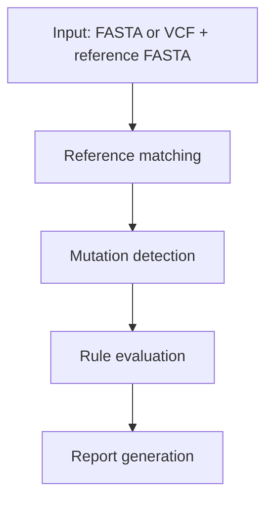

# How It Works

ResistanceProfiler is a framework for building a consistent resistance project database and then profiling new samples against it.

The core idea is that ResPro stores curated rules against internal project references, then maps new FASTA- or VCF-based inputs back into that internal reference space before comparing amino-acid mutations against the rules.

!!! tip "Think of it as a normalization framework"
    Different sample reference spaces go in, one internal project reference space comes out for rule matching.

## Pipeline overview

### Build and use one consistent project database

The project database stores internal references, CDS annotations, and curated resistance rules. All later profiling steps are anchored to this database. References and rules are matched during database creation to ensure internal consistency.

### Input parsing

- **VCF mode** uses a variant file plus a reference FASTA.
- **FASTA mode** uses a consensus sequence directly.

In both modes, input is converted into a common internal representation before rule matching.

### Reference matching and coordinate mapping

Query sequence context is aligned to the internal project references and features. The reference is determined automatically from [minimap2](https://github.com/lh3/minimap2)-based (mappy) CDS matching, and the sequence with the highest identity is selected.

VCF-derived variants are remapped from the sample reference space into the internal project coordinate system.

### Amino-acid consequence interpretation

Per-feature nucleotide changes are translated into amino-acid consequences. Supported classes include:

- Synonymous
- Missense
- Stop changes
- Frameshift
- Insertion
- Deletion
- Unknown

### Rule matching

- **Single-mutation rules** are matched directly against the observed amino-acid events.
- **Combination rules** require all grouped members to be present. This means a partial combination does not trigger the combination-level hit.
- **Interpretation algorithms** extend rule evaluation with additional logic such as phenotype counting, score-based thresholds, and IC50-based drug interpretation. See [Interpretation Algorithms](algorithms.md) for details.

!!! caution "Reference consistency matters"
    If the sample cannot be mapped confidently to a project reference, downstream rule interpretation will be limited. Keep references and rules biologically consistent.

### Reporting and exports

- HTML report is always generated.
- Optional JSON and PDF exports are available.

!!! important "Deterministic regeneration"
    Regeneration workflows depend on the stored run plus a compatible project fingerprint, which keeps report reproduction deterministic.
