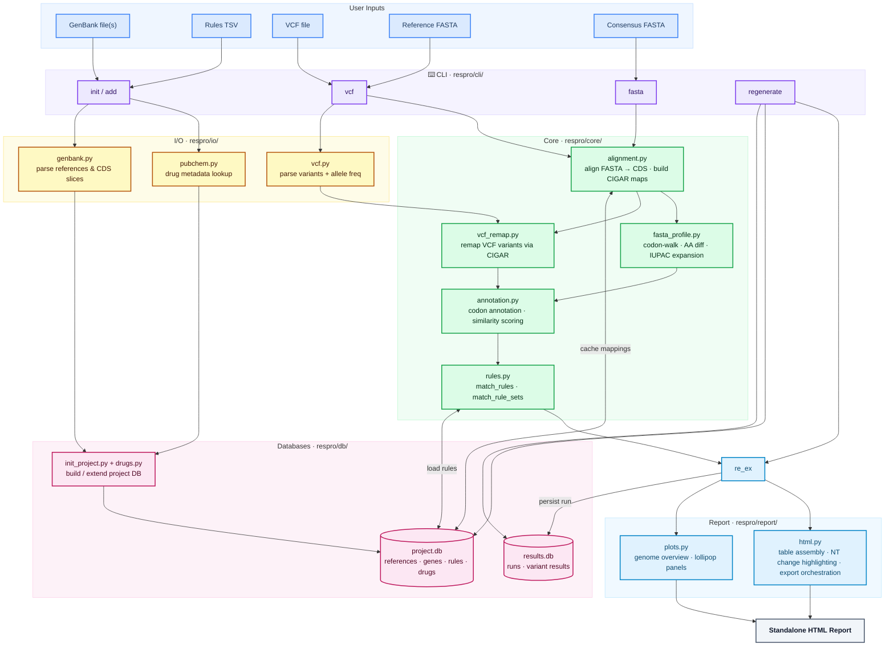

# ResistanceProfiler project structure

This document is the source of truth for how the repository is organized and where
new work should go.

For implementation priorities, see `docs/to-do.md`.
For rules TSV formatting, allowed entries, and mutation notation, see
`docs/rules-tsv-format.md`.
For the official VCF and FASTA annotation algorithms, see
`docs/annotation-algorithms.md`.
For coding standards and Copilot-specific guidance, see
`.github/copilot-instructions.md`.

## Design goals reflected in the layout

- CLI-first workflow via `respro`.
- Core profiling logic kept in `respro/`.
- SQLite-backed project data and curated rules.
- Gene-slice sequence storage (CDS-level) rather than full-reference sequence blobs.
- Codon-aware interpretation at the amino acid level.
- Deterministic outputs and regression-oriented tests.

## Top-level repository layout

```text
ReistanceProfiler/
├── .github/
│   └── copilot-instructions.md
├── docs/
│   ├── annotation-algorithms.md
│   ├── project-structure.md
│   ├── rules-tsv-format.md
│   ├── web-deployment.md
│   └── to-do.md
├── respro/
│   ├── config/
│   ├── cli/
│   │   ├── main.py
│   │   ├── init.py
│   │   ├── vcf.py
│   │   ├── fasta.py
│   │   ├── profile_helpers.py
│   │   ├── explore.py
│   │   ├── regenerate.py
│   │   ├── classify.py
│   │   └── sync.py
│   ├── core/
│   ├── db/
│   ├── io/
│   ├── report/
│   └── utils/
├── web/
│   ├── backend/
│   │   ├── defaults.toml
│   │   ├── main.py
│   │   ├── models.py
│   │   └── services/
│   └── frontend/
│       └── src/
├── tests/
├── README.md
├── docker-compose.web.yml
├── Dockerfile.web
└── pyproject.toml
```

## Tool architecture overview

The diagram below shows how the two main workflows (**database initialisation** and
**resistance profiling**) flow through the key modules.



**Init pipeline** (`respro init` / `respro add`): GenBank records and a rules TSV
are parsed by `respro/io/`, optionally enriched with PubChem drug metadata, and written
to a versioned `project.db`.

**VCF pipeline** (`respro vcf`): a user reference FASTA is aligned to internal
CDS annotations via CIGAR maps (cached in `project.db`). VCF variants are remapped from
user-reference to internal coordinates, then annotated codon-by-codon and matched against
curated resistance rules.

**FASTA pipeline** (`respro fasta`): a consensus FASTA replaces VCF input.
CIGAR maps from sequence matching are reused directly (no second alignment) to reconstruct
gapped alignment strings, which are walked in reading frame to detect SNPs, in-frame
INDELs, frameshifts, and IUPAC-ambiguous positions.

**Regenerate** (`respro regenerate`): loads a serialised run from `results.db`, validates
the project fingerprint, and re-exports the report without re-running profiling.

## Package responsibilities

### `respro/`

The main Python package. Keep it independently usable from the command line and from
future integrations.

#### `respro/config/`

Bundled configuration defaults for CLI/core integrations (for example external API URL
templates and timeout values). These files are packaged with the distribution so CLI
behavior remains deterministic in installed environments.

#### `respro/cli/`

CLI package. `main.py` defines the root Typer `app` and registers all commands via
`register(app)` helpers — it contains no command logic itself.

Command modules:
- `init.py` — `respro init`, `respro add`; also contains `init_project` and
  `add_to_project` orchestration functions; `respro init` accepts optional
  `--metadata` JSON for curated database metadata
- `vcf.py` — `respro vcf`
- `fasta.py` — `respro fasta`
- `explore.py` — `respro explore --rules` (browse resistance rules),
  `respro explore --results` (browse stored runs), or `respro explore --info`
  (show non-empty project metadata)
- `regenerate.py` — `respro regenerate` (re-export a stored run's report)
- `classify.py` — `respro classify` (add manual classification to a run)
- `sync.py` — `respro sync` (re-annotate a stored run against current project DB)
- `profile_helpers.py` — shared profiling orchestration helpers (`_finalize_and_export`,
  `_init_results_db_connection`, `_resolve_reference`, `_load_reference_data`,
  `_print_completion_panel`) used by `vcf.py`, `fasta.py`, and run mutation commands

Defines the public CLI entry points:

- `respro init`
- `respro add`
- `respro vcf`
- `respro fasta`
- `respro explore --rules *db_path` (with optional `--reference` filter)
- `respro explore --results *db_path`
- `respro regenerate`
- `respro classify`
- `respro sync`

CLI code should coordinate the pipeline and input/output handling, but avoid embedding
heavy biological logic directly in argument handlers. `respro init` is for fresh
project creation, while `respro add` extends an existing DB with additional
rules and optional new GenBank annotations. Both `vcf` and `fasta`
optionally accept `--results-db`: if the path does not exist it is created, if it
exists it is validated before profiling continues.
- `_load_reference_data` — load genes, rules, rule sets, and the set of gene names
  covered by any resistance rule for a resolved reference id.
- `_finalize_and_export` — apply rule matching and AF binning, assemble the
  `ProfilingResult`, export HTML/JSON, and optionally persist to a results DB.

### `respro/core/`

Pure profiling logic. Changes here should usually come with focused regression tests.

- `annotation.py`: codon-aware consequence annotation and translation utilities —
  `annotate_variants`, `translate_codon`, `reverse_complement`, mutation token
  normalization (`normalize_mutation`), and BLOSUM62 amino acid similarity
  scoring (`classify_similarity`).
- `rules.py`: load resistance rules from DB and match amino acid observations
  against them. Covers single-mutation rules and combination rule-set matching
  (`match_rule_sets`).
- `alignment.py`: align user-provided query sequences (FASTA) against internal
  CDS annotations using Biopython's PairwiseAligner. Produces CIGAR-based
  coordinate mappings between query positions and internal CDS positions. Only
  genes with resistance rules are screened by default. Results are cached in the
  project DB (`query_reference`, `query_gene_mapping`) so repeat runs with the
  same reference skip re-alignment.
- `query.py`: query resolution helpers shared by both profiling pipelines —
  `resolve_fasta_query`, `resolve_cached_query_reference`, `pick_best_reference_id`,
  and `select_matches_for_reference`.
- `vcf_remap.py`: VCF variant coordinate remapping — inverts CIGAR maps to remap
  variants from user-reference positions to internal CDS coordinates, verifies VCF
  REF bases against the query FASTA, and transforms REF/ALT bases to the internal
  forward strand (`remap_variants`). Also contains `_build_query_to_cds_map` and
  `_cds_pos_to_genomic_pos`.
- `vcf_coverage.py`: BAM coverage projection for VCF mode — computes per-query depth
  from BAM and projects it to internal codon coordinates via CIGAR mappings,
  emitting `CoverageGap` stretches for low-depth or non-projectable codons.
- `fasta_profile.py`: FASTA consensus profiling — orchestrates per-gene alignment
  reconstruction via `profile_fasta_consensus`, and contains all alignment-walking
  codon annotation helpers: `_annotate_from_alignment`, `_gapped_strings_from_cigar`,
  IUPAC expansion (`_expand_iupac_codon`), and consequence classification.

Use `respro/core/` for rules that should stay usable without report or storage layers.

### `respro/db/`

SQLite schema and project/results database initialization logic.

- `schema.py`: project and results schema creation plus validation helpers.
- `models.py`: central domain model and database-facing data structures, including
  `GeneMatch`, `ProfilingResult`, `Publication`, combined rule-set containers, and
  `drug_hits_json` serialization.
- `genes.py`: GenBank reference and CDS gene loading; NCBI protein URL resolution.
- `drugs.py`: drug get-or-create, case deduplication, and PubChem enrichment.
- `rules_import.py`: TSV parsing, coordinate-base detection, AA validation, combo rule sets,
  publication token normalization, and `publication` / `rule_publication` / `rule_set_publication`
  row insertion.
- `rules_queries.py`: read-only rule query helpers (`list_rules_for_display`,
  `list_references_for_display`, `get_project_summary_for_display`) used by CLI
  and web browse layers.
- `project_metadata.py`: metadata JSON validation and project-row persistence for
  curated database metadata, including best-effort PMID to DOI enrichment.
- `results.py`: profiling run persistence — `save_run`, `load_run`, `list_runs`,
  `reconstruct_annotations`, and `project_fingerprint` for cross-DB validation.

Database boundaries:

- `project.db`: curated, versioned project data (references, genes, rules, drugs).
- `results.db`: run-scoped profiling outputs (`run`, `variant_result`).

The schema also reserves tables for future combined/co-occurring resistance
rules (`resistance_rule_set`, `resistance_rule_set_member`). These are a data-
model preparation only; current profiling still evaluates single-mutation rules.

### `respro/io/`

Input readers, format-specific parsing, and lightweight external data clients.

- `vcf.py`: VCF ingestion — parses variants, extracts allele frequency (with `-1`
  sentinel when no depth field is present) and read depth.
- `genbank.py`: GenBank parsing for project initialization.
- `reference.py`: reference loading from the project DB and FASTA utilities
  (`read_fasta`, `load_reference_sequence`), plus reference-resolution helpers
  and gene loading for a resolved reference.
- `pubchem.py`: thin, stdlib-only PubChem PUG REST client. Resolves drug names
  to PubChem CIDs, canonical URLs, short descriptions, and structure-image URLs.
  All failures return `None` so callers treat PubChem lookup as strictly best-effort.
- `publications.py`: thin, stdlib-only clients for NCBI E-utilities and CrossRef.
  Resolves `PMID:` tokens to DOIs (`resolve_pubmed_to_doi`) and fetches publication
  titles (`fetch_publication_metadata`). All failures are non-fatal.

Parsing and validation should live here when they are primarily format concerns.
Once data is normalized into domain objects, downstream logic should move into
`respro/core/`.

### `respro/report/`

Rendering/export logic.

- `palette.py`: consequence-typed colour palette, reused across plots and the HTML table.
- `plots.py`: genome-overview and gene-level lollipop plot generation (matplotlib SVG).
- `html.py`: HTML rendering, table-data assembly, and export orchestration (`export_results`,
  `write_html`, `render_html`).
- `templates/report.html.j2`: Jinja2 template for report layout and client-side table sorting.
- `static/report.css`: report styles (inlined at render time for standalone HTML output).
- `static/report.js`: client-side table sorting logic (inlined at render time).
- `static/logo.svg`, `static/favicon.svg`: embedded branding assets.

All report outputs derive from `ProfilingResult` in `respro/db/models.py` so HTML and optional
machine-readable outputs stay consistent.

### `respro/utils/`

Small shared helpers that do not belong to domain modules.

- `files.py`: `require_file` — validates that a required input file exists and raises
  a clear `FileNotFoundError` with context when it does not.
- `logging.py`: `setup_logging` — configures the root `respro` logger verbosity from
  the CLI `-v`/`-vv` flags.

Keep this package narrow. Prefer putting logic close to its domain unless it is reused
cleanly across the codebase.

## Tests layout

### `tests/`

The test suite mirrors the major backend responsibilities.

- `test_annotation.py`: codon translation and consequence behavior (`annotate_vcf.py`).
- `test_sequence_matching.py`: CDS alignment, CIGAR coordinate mapping, and DB caching.
- `test_profile_fasta.py`: FASTA-based profiling — coordinate remapping, cached
  query-header resolution, sanity checks, and CLI end-to-end with `--ref-fasta`.
- `test_reference_io.py`: reference matching and normalization expectations.
- `test_reference_resolution.py`: query-to-gene reference resolution correctness.
- `test_rules.py`: resistance rule matching behavior.
- `test_profile_cli.py`: CLI-level workflow coverage.
- `test_regenerate_cli.py`: `respro explore`, `respro regenerate`, `respro classify`, and `respro sync`
  command coverage.
  fingerprint mismatch rejection.
- `test_report_outputs.py`: deterministic report/export behavior.
- `test_results_db.py`: results DB schema, save/load round-trips, and fingerprint behavior.
- `test_init_project.py`: coordinate base detection and reference AA validation.
- `test_pubchem.py`: PubChem REST client and PubChem data loading (fully mocked, no network).
- `conftest.py`: shared fixtures.

When adding behavior:

- prefer a focused regression test near the affected area;
- add codon-edge-case coverage for annotation changes;
- keep report output checks deterministic;
- avoid broad smoke tests when a narrow scenario proves the behavior better.

## Documentation layout

### `docs/to-do.md`

Planning source of truth for completed work, open items, and deferred tasks.
Review this before substantial changes.

### `docs/rules-tsv-format.md`

Primary source of truth for rules TSV columns, allowed entries, mutation notation,
phenotype normalization, IC50 handling, and combination-rule formatting.
Update this whenever rules input behavior changes.

### `docs/project-structure.md`

Update it when package responsibilities or repository layout change in a way
that affects where contributors should place code.

## How the main workflow maps to modules

A typical `respro profile` run flows through the repository like this:

1. CLI argument handling in `respro/cli/main.py`.
2. Input loading in `respro/io/`.
3. Reference resolution and variant processing in `respro/core/`.
4. Rule matching in `respro/core/resistance_rules.py`.
5. Result assembly into `ProfilingResult` in `respro/db/models.py` and related report modules.
6. Final export in `respro/report/html.py` (`export_results`).
7. Optional persistence to `results.db` via `respro/db/results.py`.

This separation helps keep logic testable and output generation consistent.

## Placement guidelines for new work

### Add code to `respro/core/` when

- the behavior changes biological interpretation;
- the logic should be reusable from CLI and future integrations;
- the code operates on normalized domain data rather than raw file parsing.

### Add code to `respro/io/` when

- the work is specific to a file format;
- the main responsibility is parsing, coercion, or raw input validation.

### Add code to `respro/report/` when

- the work changes presentation, export formatting, or output views;
- the result data already exists and only needs rendering/export.

### Add code to `respro/db/` when

- the change affects schema, curated project initialization, or bundle persistence.

### Add code to `web/backend/` when

- the work is API transport, request validation, workspace path handling, or HTTP wiring;
- existing `respro/` domain logic is reused as-is and only orchestrated for UI access.

### Add code to `web/frontend/` when

- the change concerns browser-facing UI workflows;
- the implementation can stay thin and delegate all scientific logic to backend endpoints.

### Add tests when

- behavior changes in any user-visible or scientifically relevant way;
- any new edge cases are discovered;
- export shape or report determinism changes.

## Current repository boundaries

- The repository now contains a prototype web layer (`web/`) in addition to CLI.
- Keep the core package usable without assuming a UI layer.
- The web layer must depend on stable backend/domain APIs rather than moving domain logic out of
  `respro/`.

## Maintenance rule

If you move files, split modules, or add major new subsystems, update this document in
that same change so the structure guide stays accurate.
